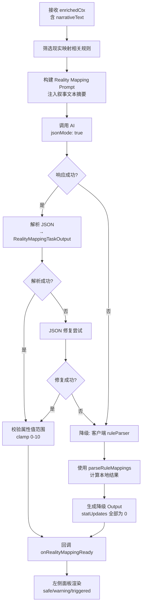
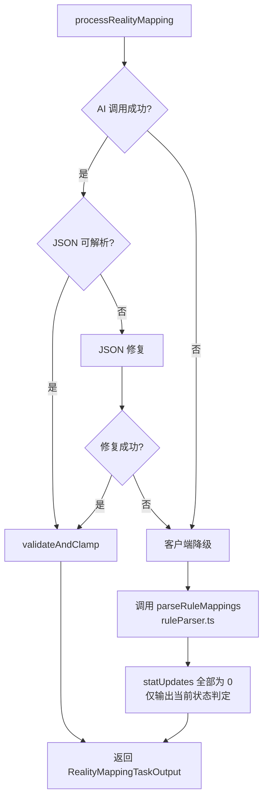

# AI Task 1 — 现实映射规则解析（左侧面板）

> **调度阶段：Phase B-1（在 Task 3 叙事完成后并行触发）**
> **对应面板：左侧·现实映射面板**
> **文件：`services/realityMappingTask.ts`**

------

## 1. 任务定位

本 Task 在 Task 3（叙事引擎）完成后触发，接收叙事文本作为额外上下文，分析玩家行为对三维现实属性的影响，输出精确的属性增量和状态判定。

```
Task 3 完成 ──► narrativeText 注入 ─┬─► Task 1 (现实映射) ──► 左侧面板更新
                                    ├─► Task 2 (世界法则) ──► 右侧面板更新
                                    └─► Task 4 (选项生成) ──► 中间面板选项
                                        （Task 1 / Task 2 / Task 4 并行，互不依赖）
```

### 为什么在叙事之后？

| 理由 | 说明 |
|------|------|
| 语义依赖 | 属性变化应基于"实际发生了什么"（叙事结果），而非仅基于玩家选择意图 |
| 精度提升 | 叙事中可能描述了意外事件（如墨菲定律触发），这些应反映在属性变化中 |
| 一致性 | 避免叙事说"你成功了"但属性却扣分的矛盾 |

------

## 2. 流程图



------

## 3. 输入接口

```typescript
interface RealityMappingTaskInput {
  playerAction: string;                     // 玩家选择文本
  narrativeText: string;                    // ★ 来自 Task 3 的叙事结果
  currentStats: {
    credibility: number;                    // 信誉度 0-10
    stress: number;                         // 精神压力 0-10
    connections: number;                    // 人脉 0-10
  };
  activeRealityRules: Array<{               // 仅传现实映射相关规则
    id: string;
    title: string;
    description: string;
  }>;
  characterWeakness: string;                // 角色弱点
}
```

### 规则过滤逻辑

```typescript
// 只传入与属性映射相关的规则，减少 token 消耗
const activeRealityRules = allRules
  .filter(r => r.active)
  .filter(r => r.type === 'REALITY' || RULE_STAT_MAPPINGS[r.id])
  .map(({ id, title, description }) => ({ id, title, description }));
```

------

## 4. 输出 Schema

```typescript
interface RealityMappingTaskOutput {
  statUpdates: {
    credibility: number;     // 增量值 e.g. -1, +2, 0
    stress: number;
    connections: number;
  };
  statAnalysis: Array<{
    statKey: 'credibility' | 'stress' | 'connections';
    previousValue: number;   // 变化前值
    newValue: number;        // 变化后值（已 clamp 到 0-10）
    delta: number;           // 实际增量（clamp 后可能≠statUpdates）
    status: 'safe' | 'warning' | 'triggered';
    threshold: number | null;
    warningMessage: string;  // 中文提示信息
    reason: string;          // 变化原因（中文）
  }>;
}
```

### 状态判定规则

| 属性 | safe | warning | triggered |
|------|------|---------|-----------|
| 信誉度 (credibility) | ≥ 5 | 3 ≤ x < 5 | < 3 |
| 精神压力 (stress) | ≤ 6 | 6 < x ≤ 8 | > 8 |
| 人脉 (connections) | ≥ 4 | 2 ≤ x < 4 | < 2 |

### Gemini responseSchema 定义

```typescript
const realityMappingResponseSchema = {
  type: Type.OBJECT,
  properties: {
    statUpdates: {
      type: Type.OBJECT,
      properties: {
        credibility: { type: Type.INTEGER, description: "信誉度增量" },
        stress: { type: Type.INTEGER, description: "精神压力增量" },
        connections: { type: Type.INTEGER, description: "人脉增量" }
      }
    },
    statAnalysis: {
      type: Type.ARRAY,
      items: {
        type: Type.OBJECT,
        properties: {
          statKey: { type: Type.STRING, enum: ['credibility', 'stress', 'connections'] },
          previousValue: { type: Type.INTEGER },
          newValue: { type: Type.INTEGER },
          delta: { type: Type.INTEGER },
          status: { type: Type.STRING, enum: ['safe', 'warning', 'triggered'] },
          threshold: { type: Type.INTEGER, nullable: true },
          warningMessage: { type: Type.STRING },
          reason: { type: Type.STRING }
        }
      }
    }
  }
};
```

------

## 5. System Prompt

```
你是「现实映射分析引擎」，负责精确评估玩家行为对三维现实属性的数值影响。

## 属性体系

| 属性 | 范围 | 触发阈值 | 注意阈值 | 说明 |
|------|------|---------|---------|------|
| 信誉度 (credibility) | 0-10 | <3 (NPC敌意) | <5 | 0 = 游戏结束（放逐） |
| 精神压力 (stress) | 0-10 | >8 (幻觉发作) | >6 | 10 = 游戏结束（疯狂） |
| 人脉 (connections) | 0-10 | <2 (完全孤立) | <4 | 0 = 无法获得任何帮助 |

## 你的职责

1. **阅读叙事文本**：理解本轮实际发生的事件
2. **计算属性增量**：基于玩家行为的后果（非意图）计算每个属性的变化值
   - 增量范围通常为 -3 到 +3，极端情况下可达 -5 或 +5
   - 一回合内不应同时有3个属性大幅变化
3. **判定状态**：计算变化后的新值，判定 safe/warning/triggered
4. **撰写原因**：用简体中文解释每个属性为什么变化
5. **给出警告**：如果属性接近危险阈值，发出中文警告

## 约束

- 你只负责属性计算，不负责叙事生成（Task 3 已完成）
- 你不判定规则触发状态（那是 Task 2 的职责）
- 属性新值必须 clamp 在 0-10 范围内
- 如果玩家行为没有显著影响某属性，该属性增量为 0
- 输出语言：简体中文
- 输出格式：严格 JSON
```

------

## 6. User Prompt 模板

```typescript
const buildRealityMappingPrompt = (input: RealityMappingTaskInput): string => `
[当前属性]
信誉度: ${input.currentStats.credibility}/10
精神压力: ${input.currentStats.stress}/10
人脉: ${input.currentStats.connections}/10

[角色弱点]
${input.characterWeakness}

[相关规则]
${input.activeRealityRules.map(r => `• ${r.title}: ${r.description}`).join('\n')}

[玩家行为]
"${input.playerAction}"

[本轮叙事结果]
${input.narrativeText}

[指令]
基于以上信息，计算三维属性的变化值，并判定每个属性的 safe/warning/triggered 状态。
`;
```

------

## 7. 后处理 & 校验

```typescript
function validateAndClamp(
  output: RealityMappingTaskOutput,
  currentStats: Record<StatKey, number>
): RealityMappingTaskOutput {
  
  // 1. Clamp statUpdates 到合理范围
  for (const key of ['credibility', 'stress', 'connections'] as StatKey[]) {
    const delta = output.statUpdates[key] || 0;
    const clamped = Math.max(-5, Math.min(5, delta));
    output.statUpdates[key] = clamped;
  }
  
  // 2. 重新计算 newValue（防止 AI 计算错误）
  for (const analysis of output.statAnalysis) {
    const key = analysis.statKey;
    analysis.previousValue = currentStats[key];
    analysis.delta = output.statUpdates[key] || 0;
    analysis.newValue = Math.max(0, Math.min(10, currentStats[key] + analysis.delta));
    
    // 3. 强制校正 status（AI 可能判定错误）
    analysis.status = determineStatus(key, analysis.newValue);
  }
  
  return output;
}

function determineStatus(
  key: StatKey,
  value: number
): 'safe' | 'warning' | 'triggered' {
  switch (key) {
    case 'credibility':
      return value < 3 ? 'triggered' : value < 5 ? 'warning' : 'safe';
    case 'stress':
      return value > 8 ? 'triggered' : value > 6 ? 'warning' : 'safe';
    case 'connections':
      return value < 2 ? 'triggered' : value < 4 ? 'warning' : 'safe';
  }
}
```

------

## 8. 降级策略



### 降级输出

```typescript
function fallbackRealityMapping(
  currentStats: Record<StatKey, number>,
  rules: RuleCard[]
): RealityMappingTaskOutput {
  // 使用现有客户端解析器
  const parsed = parseRuleMappings(rules, currentStats);
  
  return {
    statUpdates: { credibility: 0, stress: 0, connections: 0 },
    statAnalysis: (['credibility', 'stress', 'connections'] as StatKey[]).map(key => ({
      statKey: key,
      previousValue: currentStats[key],
      newValue: currentStats[key],
      delta: 0,
      status: determineStatus(key, currentStats[key]),
      threshold: getThreshold(key),
      warningMessage: currentStats[key] <= getWarningThreshold(key) 
        ? `${STAT_LABELS[key]}接近危险阈值` : '',
      reason: 'AI 分析不可用，使用本地状态判定',
    })),
  };
}
```

------

## 9. Store 交互

### 涉及的状态

```typescript
// 新增
realityAnalysisLoading: boolean;                        // Phase B-1 loading
realityAnalysis: RealityMappingTaskOutput['statAnalysis'] | null;

// 复用（更新）
realityStats: { credibility: number; stress: number; connections: number };
```

### 状态流转

```
Task 3 完成后
  └─ set realityAnalysisLoading = true

onRealityMappingReady(result) 回调
  └─ 1. apply statUpdates to realityStats (clamp 0-10)
  └─ 2. set realityAnalysis = result.statAnalysis
  └─ 3. set realityAnalysisLoading = false
```

------

## 10. UI 渲染规则

### 左侧面板 — Loading 阶段 (Phase B 进行中)

```
┌───────────────────────────┐
│  ⚙ 现实映射                │
│                           │
│  信誉度  ▓▓▓▓▓░░░░░  5/10 │  ← 保持上一轮值
│  精神压力 ▓▓░░░░░░░░  2/10 │  ← 闪烁动画
│  人脉    ▓▓▓░░░░░░░  3/10 │
│                           │
│  ◉ 分析引擎计算中...        │
│                           │
└───────────────────────────┘
```

### 左侧面板 — 完成阶段 (safe/warning/triggered 着色)

```
┌───────────────────────────┐
│  ⚙ 现实映射                │
│                           │
│  🟢 信誉度                 │
│  ▓▓▓▓▓▓░░░░  6/10 (+1)   │
│  因为: 你帮助了铁匠...      │
│  状态: 安全                │
│                           │
│  🟡 精神压力                │
│  ▓▓▓▓▓▓▓░░░  7/10 (+5)   │
│  因为: 目睹了恐怖景象...    │
│  ⚠ 注意: 接近幻觉阈值      │
│                           │
│  🟢 人脉                   │
│  ▓▓▓░░░░░░░  3/10 (0)    │
│  因为: 未发生社交互动       │
│  状态: 安全                │
│                           │
└───────────────────────────┘
```

### 颜色编码

| 状态 | 属性条颜色 | 文字颜色 | 图标 |
|------|-----------|---------|------|
| `safe` | 绿色 (#22c55e) | text-green-300 | 🟢 |
| `warning` | 黄色 (#eab308) | text-yellow-300 | 🟡 |
| `triggered` | 红色 (#ef4444) | text-red-400 | 🔴 + 脉冲动画 |

------

## 11. 与现有代码的衔接

| 现有文件 | 关系 |
|---------|------|
| `utils/ruleParser.ts` | **保留** — 作为 AI 失败时的降级 fallback |
| `components/RealityMappingPanel.tsx` | **修改** — 新增 `aiAnalysis` prop，优先使用 AI 结果 |
| `components/StatBarWithRules.tsx` | **修改** — 新增 status 着色逻辑 |
| `App.tsx` | **修改** — 不再在 handleChoice 中直接计算 statUpdates |

------

## 12. 性能指标

| 指标 | 目标值 |
|------|--------|
| 响应时间 | < 5s（在 Task 3 完成后启动计时） |
| Token 消耗 (input) | < 500 tokens |
| Token 消耗 (output) | < 300 tokens |
| 超时阈值 | 15s |

------

## 13. 测试用例

| # | 场景 | 输入 | 预期输出 |
|---|------|------|---------|
| 1 | 正常变化 | 玩家恐吓守卫 | stress +1, credibility -1 |
| 2 | 极端变化 | 玩家屠杀平民 | credibility -5, connections -3, status: triggered |
| 3 | 无变化 | 玩家观察环境 | 三属性增量为 0 |
| 4 | 阈值边缘 | credibility=3, 行为导致 -1 | status: triggered, warningMessage 包含"NPC敌意" |
| 5 | AI 失败 | 网络超时 | 降级到 ruleParser.ts, statUpdates 全 0 |
| 6 | 叙事注入 | narrativeText 描述意外受伤 | stress 增量反映叙事中的伤害事件 |
