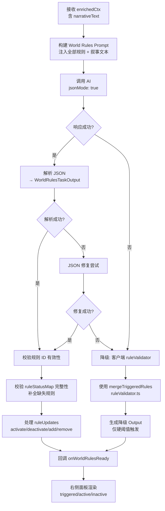
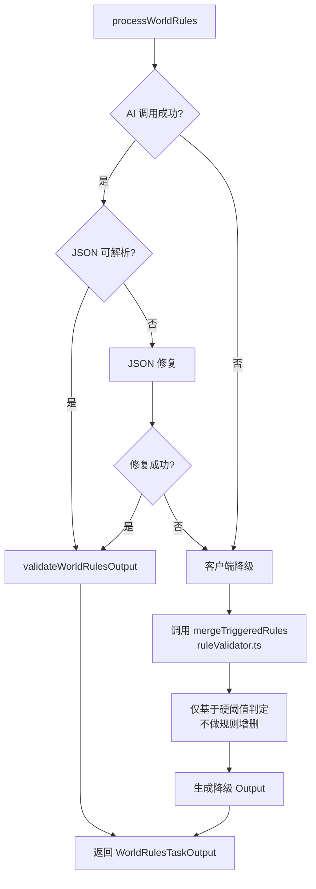

# AI Task 2 — 世界法则触发判定（右侧面板）

> **调度阶段：Phase B-2（在 Task 3 叙事完成后并行触发）**
> **对应面板：右侧·世界法则面板**
> **文件：`services/worldRulesTask.ts`**

------

## 1. 任务定位

本 Task 在 Task 3（叙事引擎）完成后触发，与 Task 1（现实映射）和 Task 4（选项生成）并行执行。它接收叙事文本作为额外上下文，判定所有规则卡的触发状态，并管理规则的生命周期（激活/休眠/新增/移除）。

```
Task 3 完成 ──► narrativeText 注入 ─┬─► Task 1 (现实映射) [并行]
                                    ├─► Task 2 (世界法则) [并行] ──► 右侧面板更新
                                    └─► Task 4 (选项生成) [并行]
```

### 为什么在叙事之后？

| 理由 | 说明 |
|------|------|
| 因果一致性 | 规则触发应基于实际叙事结果，而非仅玩家意图 |
| 叙事驱动 | 叙事中可能发生的意外事件（如墨菲定律触发计划失败）直接影响规则判定 |
| 规则演化 | 新增/移除规则应与叙事走向保持叙事逻辑一致 |

------

## 2. 流程图



------

## 3. 输入接口

```typescript
interface WorldRulesTaskInput {
  playerAction: string;                     // 玩家选择文本
  narrativeText: string;                    // ★ 来自 Task 3 的叙事结果
  allRules: Array<{                         // 所有规则（含激活和休眠）
    id: string;
    title: string;
    type: 'CONSTRAINT' | 'BONUS' | 'RISK' | 'REALITY';
    description: string;
    active: boolean;
  }>;
  currentStats: {
    credibility: number;
    stress: number;
    connections: number;
  };
  turnCount: number;
  historySummary: string;                    // 截断到最近 500 字符
}
```

------

## 4. 输出 Schema

```typescript
interface WorldRulesTaskOutput {
  /** 本轮被触发的规则列表（含原因） */
  triggeredRules: Array<{
    ruleId: string;          // 必须是现有规则 ID
    ruleTitle: string;
    reason: string;          // 触发原因（中文）
  }>;

  /** 规则生命周期变更 */
  ruleUpdates: {
    activate: string[];      // 从休眠→激活的规则 ID
    deactivate: string[];    // 从激活→休眠的规则 ID
    add: Array<{             // 新增规则
      id: string;
      title: string;
      type: 'CONSTRAINT' | 'BONUS' | 'RISK' | 'REALITY';
      description: string;
      active: boolean;
    }>;
    removeIds: string[];     // 永久移除的规则 ID
  };

  /** 全量规则状态映射（含所有现存规则） */
  ruleStatusMap: Record<string, 'triggered' | 'active_not_triggered' | 'inactive'>;
}
```

### 规则状态定义

| 状态 | 含义 | UI 表现 |
|------|------|---------|
| `triggered` | 本轮触发，规则效果生效 | 黄色高亮 + ⚡badge + 脉冲动画 |
| `active_not_triggered` | 激活态但本轮未触发 | 绿色 badge「激活」 |
| `inactive` | 休眠态 | 灰色 badge「休眠」 |

### Gemini responseSchema 定义

```typescript
const worldRulesResponseSchema = {
  type: Type.OBJECT,
  properties: {
    triggeredRules: {
      type: Type.ARRAY,
      items: {
        type: Type.OBJECT,
        properties: {
          ruleId: { type: Type.STRING },
          ruleTitle: { type: Type.STRING },
          reason: { type: Type.STRING }
        }
      }
    },
    ruleUpdates: {
      type: Type.OBJECT,
      properties: {
        activate: { type: Type.ARRAY, items: { type: Type.STRING } },
        deactivate: { type: Type.ARRAY, items: { type: Type.STRING } },
        add: {
          type: Type.ARRAY,
          items: {
            type: Type.OBJECT,
            properties: {
              id: { type: Type.STRING },
              title: { type: Type.STRING },
              type: { type: Type.STRING, enum: ['CONSTRAINT', 'BONUS', 'RISK', 'REALITY'] },
              description: { type: Type.STRING },
              active: { type: Type.BOOLEAN }
            }
          }
        },
        removeIds: { type: Type.ARRAY, items: { type: Type.STRING } }
      }
    },
    ruleStatusMap: {
      type: Type.OBJECT,
      description: "键为规则 ID，值为 triggered | active_not_triggered | inactive"
    }
  }
};
```

------

## 5. System Prompt

```
你是「世界法则裁定引擎」，负责判定所有规则卡在当前回合的触发状态，并管理规则生命周期。

## 规则状态定义

| 状态 | 含义 |
|------|------|
| triggered | 本轮触发：玩家行为（结合叙事结果）满足规则触发条件 |
| active_not_triggered | 激活未触发：规则处于激活状态但本轮未被触发 |
| inactive | 未激活：规则处于休眠状态，不参与判定 |

## 你的职责

### 1. 触发判定
- 阅读叙事文本，理解本轮**实际发生的事件**
- 逐条检查所有**激活**规则，判定是否被触发
- 被触发的规则必须在 triggeredRules 中列出，并说明触发原因
- 触发原因必须引用叙事中的具体事件

### 2. 规则生命周期管理
根据叙事发展，你可以执行以下操作（均需有合理叙事依据）：

| 操作 | 说明 | 约束 |
|------|------|------|
| activate | 将休眠规则激活 | 仅对已有 inactive 规则 |
| deactivate | 将激活规则休眠 | 仅对已有 active 规则 |
| add | 新增规则 | 需提供完整规则卡信息，符合暗黑奇幻美学 |
| remove | 永久移除规则 | 谨慎使用，通常用于一次性规则消耗后 |

### 3. 全量状态映射
- 输出 ruleStatusMap 必须包含**所有现存规则**（含新增，不含已移除）
- 每个规则 ID 必须有且仅有一个状态值

## 判定指南

### 常见规则触发逻辑（参考）
- **等价交换法则**：当玩家使用魔法或获取重要物品时触发
- **社会信誉**：当信誉度 < 3 或压力 > 8 时触发
- **墨菲定律**：当玩家制定超过2步的计划时触发
- **主角光环**：当玩家面临致命威胁时触发（仅一次）
- **铁律物理**：涉及物理动作（跌落、战斗、负重）时触发
- **夜惊**：夜间行动时触发

### 新增规则要求
- 标题：4-8个中文字符，有叙事质感
- 描述：20-50字，说明触发条件和效果
- 类型：CONSTRAINT（限制）、BONUS（增益）、RISK（风险）、REALITY（映射）
- ID 格式：`r` + 数字（递增自 r100 起，避免与现有冲突）

## 约束

- 你只负责规则判定，不负责叙事生成（Task 3 已完成）
- 你不负责属性数值计算（那是 Task 1 的职责）
- 一次最多触发 3 条规则
- 一次最多新增 1 条规则
- 输出语言：简体中文
- 输出格式：严格 JSON
```

------

## 6. User Prompt 模板

```typescript
const buildWorldRulesPrompt = (input: WorldRulesTaskInput): string => `
[当前回合]
回合 ${input.turnCount}

[当前属性]
信誉度: ${input.currentStats.credibility}/10
精神压力: ${input.currentStats.stress}/10
人脉: ${input.currentStats.connections}/10

[全部规则注册表]
--- 激活规则 ---
${input.allRules.filter(r => r.active).map(r =>
  `[${r.id}] ${r.title} (${r.type}): ${r.description}`
).join('\n')}

--- 休眠规则 ---
${input.allRules.filter(r => !r.active).map(r =>
  `[${r.id}] ${r.title} (${r.type}): ${r.description}`
).join('\n')}

[历史摘要]
${input.historySummary}

[玩家行为]
"${input.playerAction}"

[本轮叙事结果]
${input.narrativeText}

[指令]
1. 判定每条激活规则是否被触发，列出 triggeredRules（含原因）
2. 决定是否需要 activate/deactivate/add/remove 规则
3. 输出 ruleStatusMap：所有规则的最新状态
`;
```

------

## 7. 后处理 & 校验

```typescript
function validateWorldRulesOutput(
  output: WorldRulesTaskOutput,
  existingRules: RuleCard[]
): WorldRulesTaskOutput {
  const existingIds = new Set(existingRules.map(r => r.id));

  // 1. 过滤无效的 triggeredRules（引用不存在的 ruleId）
  output.triggeredRules = output.triggeredRules.filter(tr => 
    existingIds.has(tr.ruleId)
  );

  // 2. 过滤无效的 activate/deactivate IDs
  output.ruleUpdates.activate = output.ruleUpdates.activate.filter(id => 
    existingIds.has(id)
  );
  output.ruleUpdates.deactivate = output.ruleUpdates.deactivate.filter(id =>
    existingIds.has(id)
  );
  output.ruleUpdates.removeIds = output.ruleUpdates.removeIds.filter(id =>
    existingIds.has(id)
  );

  // 3. 为新增规则生成安全 ID（如果 AI 给了冲突 ID）
  for (const newRule of output.ruleUpdates.add) {
    if (existingIds.has(newRule.id)) {
      newRule.id = `r${Date.now() % 10000}`;
    }
    existingIds.add(newRule.id);
  }

  // 4. 补全 ruleStatusMap（AI 可能遗漏部分规则）
  const triggeredSet = new Set(output.triggeredRules.map(tr => tr.ruleId));
  const activateSet = new Set(output.ruleUpdates.activate);
  const deactivateSet = new Set(output.ruleUpdates.deactivate);
  const removeSet = new Set(output.ruleUpdates.removeIds);

  for (const rule of existingRules) {
    if (removeSet.has(rule.id)) continue;

    if (!output.ruleStatusMap[rule.id]) {
      // AI 遗漏了这条规则，补全默认状态
      if (triggeredSet.has(rule.id)) {
        output.ruleStatusMap[rule.id] = 'triggered';
      } else if (rule.active && !deactivateSet.has(rule.id) || activateSet.has(rule.id)) {
        output.ruleStatusMap[rule.id] = 'active_not_triggered';
      } else {
        output.ruleStatusMap[rule.id] = 'inactive';
      }
    }
  }

  // 5. 新增规则也需要在 statusMap 中
  for (const newRule of output.ruleUpdates.add) {
    if (!output.ruleStatusMap[newRule.id]) {
      output.ruleStatusMap[newRule.id] = newRule.active ? 'active_not_triggered' : 'inactive';
    }
  }

  // 6. 限制约束：最多 3 个 triggered，最多 1 个 add
  if (output.triggeredRules.length > 3) {
    output.triggeredRules = output.triggeredRules.slice(0, 3);
  }
  if (output.ruleUpdates.add.length > 1) {
    output.ruleUpdates.add = output.ruleUpdates.add.slice(0, 1);
  }

  return output;
}
```

------

## 8. 降级策略



### 降级输出

```typescript
function fallbackWorldRules(
  activeRules: RuleCard[],
  allRules: RuleCard[],
  newStats: Record<StatKey, number>,
  aiTriggeredRules: TriggeredRule[] = []
): WorldRulesTaskOutput {
  // 使用现有客户端验证器
  const merged = mergeTriggeredRules({ activeRules, newStats, aiTriggeredRules });
  const triggeredSet = new Set(merged.map(tr => tr.ruleId));

  const ruleStatusMap: Record<string, 'triggered' | 'active_not_triggered' | 'inactive'> = {};
  for (const rule of allRules) {
    if (triggeredSet.has(rule.id)) {
      ruleStatusMap[rule.id] = 'triggered';
    } else if (rule.active) {
      ruleStatusMap[rule.id] = 'active_not_triggered';
    } else {
      ruleStatusMap[rule.id] = 'inactive';
    }
  }

  return {
    triggeredRules: merged,
    ruleUpdates: {
      activate: [],
      deactivate: [],
      add: [],
      removeIds: [],
    },
    ruleStatusMap,
  };
}
```

------

## 9. Store 交互

### 涉及的状态

```typescript
// 新增
worldRulesLoading: boolean;                              // Phase B-2 loading
ruleStatusMap: Record<string, 'triggered' | 'active_not_triggered' | 'inactive'>;

// 复用（更新）
rules: RuleCard[];                                       // 全量规则数组
currentTriggeredRules: TriggeredRule[];                   // 本轮触发列表
```

### 状态流转

```
Task 3 完成后
  └─ set worldRulesLoading = true

onWorldRulesReady(result) 回调
  └─ 1. 处理 ruleUpdates:
  │     ├─ activate: 将指定 rule.active 设为 true
  │     ├─ deactivate: 将指定 rule.active 设为 false
  │     ├─ add: 追加新规则到 rules 数组
  │     └─ removeIds: 从 rules 数组中移除
  │
  └─ 2. set ruleStatusMap = result.ruleStatusMap
  └─ 3. set currentTriggeredRules = result.triggeredRules
  └─ 4. set worldRulesLoading = false
```

### 规则更新处理逻辑

```typescript
function applyRuleUpdates(
  currentRules: RuleCard[],
  updates: WorldRulesTaskOutput['ruleUpdates']
): RuleCard[] {
  let rules = [...currentRules];

  // 1. Remove
  if (updates.removeIds.length > 0) {
    const removeSet = new Set(updates.removeIds);
    rules = rules.filter(r => !removeSet.has(r.id));
  }

  // 2. Activate
  for (const id of updates.activate) {
    const rule = rules.find(r => r.id === id);
    if (rule) rule.active = true;
  }

  // 3. Deactivate
  for (const id of updates.deactivate) {
    const rule = rules.find(r => r.id === id);
    if (rule) rule.active = false;
  }

  // 4. Add
  rules.push(...updates.add);

  return rules;
}
```

------

## 10. UI 渲染规则

### 右侧面板 — Loading 阶段

```
┌────────────────────────────┐
│  世界法则        [⏳计算中]  │
│──────────────────────────── │
│                            │
│  ┌────────────────────┐    │
│  │ 等价交换法则         │    │  ← 保持上一轮状态
│  │ [激活]              │    │  ← 显示骨架 loading
│  └────────────────────┘    │
│  ┌────────────────────┐    │
│  │ 社会信誉            │    │
│  │ [激活]              │    │
│  └────────────────────┘    │
│  ...                       │
│                            │
│  ◉ 法则裁定引擎计算中...    │
│                            │
└────────────────────────────┘
```

### 右侧面板 — 完成阶段（四状态渲染）

```
┌────────────────────────────┐
│  世界法则   [⚡2触发] [6激活] │
│──────────────────────────── │
│                            │
│  ┌─── triggered ──────┐    │
│  │ ⚡ 墨菲定律          │    │  ← 黄色高亮 + 脉冲
│  │ [已触发]            │    │
│  │ 原因: 你的3步计划... │    │
│  └────────────────────┘    │
│  ┌─── triggered ──────┐    │
│  │ ⚡ 铁律物理          │    │  ← 黄色高亮 + 脉冲
│  │ [已触发]            │    │
│  │ 原因: 你从高处跳下... │    │
│  └────────────────────┘    │
│  ┌─── active ─────────┐    │
│  │ 等价交换法则         │    │
│  │ [激活]              │    │  ← 绿色 badge
│  └────────────────────┘    │
│  ┌─── active ─────────┐    │
│  │ 社会信誉            │    │
│  │ [激活]              │    │
│  └────────────────────┘    │
│  ┌─── inactive ───────┐    │
│  │ 八卦网络            │    │
│  │ [休眠]              │    │  ← 灰色半透明
│  └────────────────────┘    │
│  ┌─── new ────────────┐    │
│  │ ✨ 骨折之痛          │    │  ← 入场动画
│  │ [激活] NEW          │    │
│  │ 跌落导致骨折...      │    │
│  └────────────────────┘    │
│                            │
│  ┈┈ 隐藏的规则在黑暗中... ┈┈ │
│                            │
└────────────────────────────┘
```

### 排序规则

```typescript
const sortedRules = rules.sort((a, b) => {
  const order = { triggered: 0, active_not_triggered: 1, inactive: 2 };
  const statusA = ruleStatusMap[a.id] || 'inactive';
  const statusB = ruleStatusMap[b.id] || 'inactive';
  return order[statusA] - order[statusB];
});
```

### 视觉状态映射

| 状态 | 边框颜色 | Badge | 动画 | 透明度 |
|------|---------|-------|------|--------|
| `triggered` | border-yellow-400 | ⚡已触发 (bg-yellow-500 text-black) | pulse + glow | 100% |
| `active_not_triggered` | 保持原类型颜色 | 激活 (bg-green-700) | 无 | 100% |
| `inactive` | border-gray-700 | 休眠 (bg-stone-gray/40) | 无 | 50% |
| 新增 (add) | border-purple-400 | ✨NEW (bg-purple-600) | slideIn + sparkle | 100% |

------

## 11. 与现有代码的衔接

| 现有文件 | 关系 |
|---------|------|
| `utils/ruleValidator.ts` | **保留** — 作为 AI 失败时的降级 fallback |
| `components/RuleCard.tsx` | **修改** — 新增 `ruleStatus` prop，替代原有 `triggered/active/inactive` 判定 |
| `App.tsx` | **修改** — 不再在 handleChoice 中直接处理 ruleUpdates |
| `store/index.ts` | **修改** — 新增 `ruleStatusMap` + `worldRulesLoading` |

### RuleCard 组件变更

```typescript
// 原来的判定逻辑（在组件内部）
const tooltipMode: RuleTooltipMode = !rule.active
  ? 'inactive'
  : isTriggered
  ? 'triggered'
  : 'active';

// 改为读取 ruleStatusMap（从 store 或 prop 获取）
const tooltipMode: RuleTooltipMode = ruleStatusMap[rule.id] || 'inactive';
```

------

## 12. 性能指标

| 指标 | 目标值 |
|------|--------|
| 响应时间 | < 6s（在 Task 3 完成后启动计时） |
| Token 消耗 (input) | < 700 tokens |
| Token 消耗 (output) | < 400 tokens |
| 超时阈值 | 15s |

------

## 13. 测试用例

| # | 场景 | 输入 | 预期输出 |
|---|------|------|---------|
| 1 | 单规则触发 | 玩家制定3步计划 | triggeredRules 含墨菲定律 |
| 2 | 多规则触发 | 夜间使用魔法 | 夜惊 + 等价交换 + 奥术共鸣（如激活） |
| 3 | 无触发 | 安静观察 | triggeredRules 为空 |
| 4 | 激活休眠规则 | 进入城镇 | 八卦网络从 inactive → active |
| 5 | 新增规则 | 受重伤 | add 包含"骨折之痛"新规则 |
| 6 | 移除规则 | 主角光环触发后 | removeIds 含主角光环 (r5) |
| 7 | AI 失败 | 网络超时 | 降级到 ruleValidator.ts 硬阈值判定 |
| 8 | 叙事影响 | 叙事描述被背叛 | 触发血债(r7)如激活，或激活血债 |
| 9 | ruleStatusMap 完整性 | 12条规则 | statusMap 包含所有12条 |
| 10 | 上限约束 | AI 触发5条规则 | 截断为3条 |
