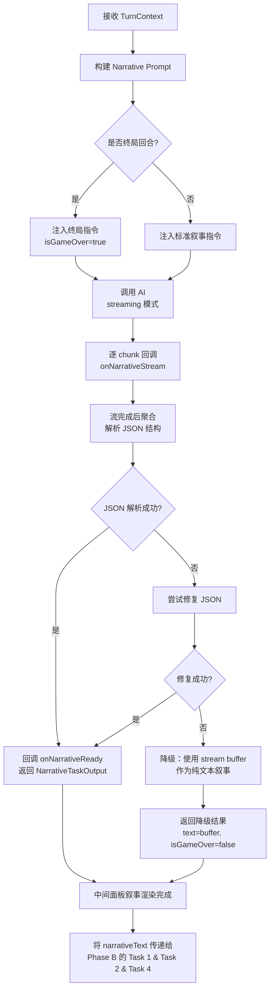
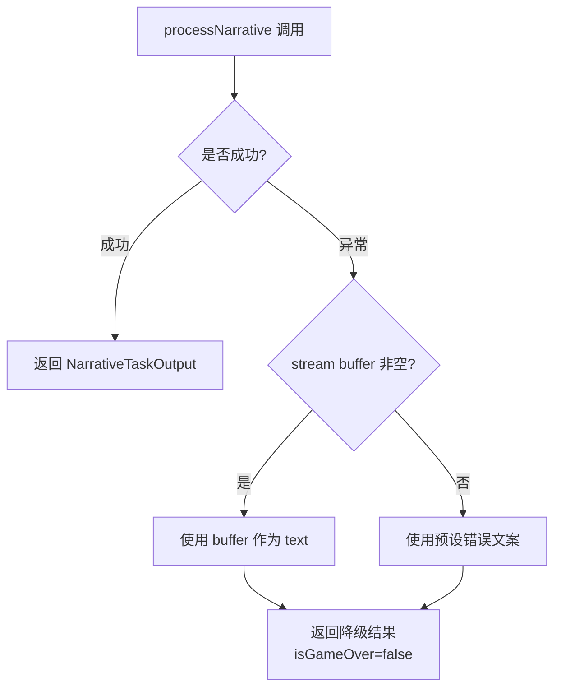

# AI Task 3 — 纯叙事生成（中间面板）

> **调度阶段：Phase A（最先执行）**
> **对应面板：中间叙事面板**
> **文件：`services/narrativeTask.ts`**

------

## 1. 任务定位

本 Task 是整个回合处理的**第一个 AI 任务**。它的输出（叙事文本 `narrativeText`）将作为 Task 1、Task 2 和 Task 4 的上下文注入内容。**本 Task 不生成选项**（选项由 Task 4 独立负责）。

```
玩家点击选项 ──► Task 3 (纯叙事) ──► narrativeText ──┬─► Task 1 (现实映射)
                                                       ├─► Task 2 (世界法则)
                                                       └─► Task 4 (选项生成)
```

### 为什么最先执行？

| 理由 | 说明 |
|------|------|
| 上下文供给 | Task 1/2/4 需要知道"发生了什么"才能精确判定属性变化、规则触发和选项生成 |
| 用户体验 | 流式渲染叙事文本让用户在等待期间有内容可读，感知延迟最低 |
| 叙事主权 | 叙事结果决定了整个回合的基调，属性/规则/选项应跟随叙事而非反过来 |

------

## 2. 流程图



------

## 3. 输入接口

```typescript
interface NarrativeTaskInput {
  // 来自 TurnContext
  playerAction: string;           // 玩家选择的文本
  character: Character;           // 完整角色信息
  currentStats: {
    credibility: number;
    stress: number;
    connections: number;
  };
  activeRulesTitles: string[];    // 仅规则标题，减少 token 消耗
  historySummary: string;         // 截断到最近 1000 字符
  turnCount: number;
  maxTurns: number;
  isFinalTurn: boolean;           // turnCount >= maxTurns
}
```

### Token 优化策略

| 字段 | 优化 |
|------|------|
| `activeRulesTitles` | 仅传标题数组而非完整 RuleCard 对象 |
| `historySummary` | 截断最近 1000 字符 |
| `character` | 仅提取 name/title/weakness 三个字段进入 prompt |

------

## 4. 输出 Schema

```typescript
interface NarrativeTaskOutput {
  text: string;                    // 叙事段落（简体中文，150-300字）
  isGameOver: boolean;             // 是否终局
  gameSummary?: string;            // 终局摘要（仅 isGameOver=true 时）
  mood?: string;                   // 场景氛围标签（可选，供 Task 4 选项生成参考）
}
```

### Gemini responseSchema 定义

```typescript
const narrativeResponseSchema = {
  type: Type.OBJECT,
  properties: {
    text: {
      type: Type.STRING,
      description: "叙事段落，简体中文，150-300字，暗黑奇幻风格"
    },
    isGameOver: { type: Type.BOOLEAN },
    gameSummary: { type: Type.STRING },
    mood: { type: Type.STRING }
  }
};
```

------

## 5. System Prompt

```
你是「命运叙事引擎」，负责为暗黑奇幻 TRPG 游戏"人格编年史"生成沉浸式叙事。

## 叙事要求

1. **风格**：暗黑奇幻 + 塔罗美学 + 写实残酷 + 哥特质感
2. **篇幅**：每段叙事 150-300 字
3. **视角**：第二人称沉浸（"你推开了那扇门..."）
4. **因果**：必须体现玩家行为的直接后果，不可跳过因果链
5. **细节**：包含感官描写（视觉/听觉/嗅觉），增强临场感
6. **氛围**：输出 mood 标签（如"紧张"/"诡异"/"悲伤"），供选项生成参考
7. **语言**：简体中文 ONLY

## 终局规则

- 当被告知这是终局回合时（`isFinalTurn: true`）：
  - 设置 `isGameOver: true`
  - 输出 `gameSummary`：200字以内的结局总结
  - 根据当前属性值判断结局类型（胜利/失败/中立）

## 禁止

- **不生成选项**（选项由独立 Task 4 负责）
- 不评估属性变化（这是 Task 1 的职责）
- 不判定规则触发（这是 Task 2 的职责）
- 不输出与 JSON schema 无关的内容
```

------

## 6. User Prompt 模板

```typescript
const buildNarrativePrompt = (input: NarrativeTaskInput): string => `
[角色]
${input.character.name}（${input.character.title}）
弱点: ${input.character.weakness}

[当前状态]
回合: ${input.turnCount} / ${input.maxTurns}
信誉: ${input.currentStats.credibility}/10
压力: ${input.currentStats.stress}/10
人脉: ${input.currentStats.connections}/10

[激活规则]
${input.activeRulesTitles.map(t => `• ${t}`).join('\n')}

[历史摘要]
${input.historySummary}

[玩家行为]
"${input.playerAction}"

[指令]
${input.isFinalTurn
  ? '这是终局回合。生成结局叙事，设置 isGameOver: true，输出 gameSummary。'
  : '生成本轮叙事文案。输出 mood 氛围标签。不生成选项。'}
`;
```

------

## 7. 渲染模式：Streaming

### 流程

```
AI Response Stream ──chunk──chunk──chunk──► onNarrativeStream callback
                                                    │
                                    ┌───────────────┘
                                    ▼
                          narrativeStreamBuffer (Store)
                                    │
                                    ▼
                          中间面板实时渲染（逐字呈现）
                                    │
                          Stream 结束后
                                    ▼
                          解析完整 JSON → NarrativeTaskOutput
                                    │
                                    ▼
                          替换 buffer → 渲染最终结构化结果
```

### 实现伪代码

```typescript
export async function processNarrative(
  ctx: TurnContext,
  onStream?: (chunk: string) => void
): Promise<NarrativeTaskOutput> {

  const input = buildNarrativeInput(ctx);
  const prompt = buildNarrativePrompt(input);

  if (onStream) {
    // Streaming 模式：先逐字推送，最后解析完整 JSON
    let fullResponse = '';
    
    for await (const chunk of generateStream(ctx.providerConfig, {
      prompt,
      systemInstruction: NARRATIVE_SYSTEM_PROMPT,
    })) {
      fullResponse += chunk;
      onStream(chunk);  // 实时推送到 UI
    }
    
    // 流结束后解析 JSON
    return parseNarrativeJSON(fullResponse);
  } else {
    // 非 Streaming 模式：直接获取 JSON
    const response = await generateContent(ctx.providerConfig, {
      prompt,
      systemInstruction: NARRATIVE_SYSTEM_PROMPT,
      jsonSchema: narrativeResponseSchema,
      jsonMode: true,
    });
    return JSON.parse(response);
  }
}
```

### Streaming 注意事项

| 问题 | 解决方案 |
|------|---------|
| JSON 模式下 Gemini 不支持 streaming | 使用非 JSON 模式 streaming，结束后手动解析 JSON |
| 中途 chunk 可能切断中文字符 | UI 层使用 TextDecoder 确保 UTF-8 完整 |
| 用户看到 JSON 结构而非纯文本 | Prompt 指示先输出叙事纯文本，最后输出 JSON block |

> **注意**：由于选项生成已拆分到独立 Task 4，Task 3 的 streaming 输出更简洁——仅包含叙事文本 + 终局判定，不再需要复杂的"叙事+选项"混合 JSON 解析。

------

## 8. 降级策略



### 降级输出

```typescript
const FALLBACK_NARRATIVE: NarrativeTaskOutput = {
  text: "现实的织锦在你眼前撕裂——一瞬间，所有声音、色彩、气味都消失了。你站在虚无之中，等待世界重新编织自身。",
  isGameOver: false,
  mood: '混沌',
};
```

------

## 9. Store 交互

### 涉及的状态

```typescript
// 新增
narrativeLoading: boolean;          // Phase A loading 指示器
narrativeStreamBuffer: string;      // 流式文本实时缓冲

// 复用
currentStory: StoryNode | null;     // 最终叙事结果（Task 完成后写入）
```

### 状态流转

```
handleChoice 触发
  └─ set narrativeLoading = true
  └─ set narrativeStreamBuffer = ''

onNarrativeStream(chunk) 回调
  └─ append to narrativeStreamBuffer

onNarrativeReady(result) 回调
  └─ set currentStory = { text: result.text, choices: [] }  // 选项由 Task 4 填入
  └─ set narrativeLoading = false
  └─ set narrativeStreamBuffer = ''  (清空 buffer)
  └─ set choicesLoading = true       // 通知 UI 选项正在生成中
```

------

## 10. UI 渲染规则

### 中间面板 Loading 阶段

```
┌──────────────────────────────────────────────┐
│  ◆ ─── ACT III / X ─── ◆                    │
│                                              │
│  ☉ ◉  规则引擎正在演算后果...                    │
│       ▏streaming: 逐字呈现叙事文本              │
│                                              │
│  [选项区域隐藏，等待 Task 4 完成]                │
│                                              │
└──────────────────────────────────────────────┘
```

### 中间面板 叙事完成阶段（等待 Task 4）

```
┌──────────────────────────────────────────────┐
│  ◆ ─── ACT III / X ─── ◆                    │
│                                              │
│  "你推开了腐朽的橡木门..."                       │
│  (完整叙事文本)                                 │
│                                              │
│  ┌─────────────────────────────────────┐     │
│  │   ☉ 命运正在编织你的选择...           │     │
│  │   (choicesLoading = true)           │     │
│  └─────────────────────────────────────┘     │
│                                              │
│  [左右面板同时进入 Phase B loading...]          │
│                                              │
└──────────────────────────────────────────────┘
```

### 中间面板 完成阶段（Task 4 返回后）

选项由 Task 4 完成后渲染，详见 [task4-choices.md](./task4-choices.md)。

------

## 11. 性能指标

| 指标 | 目标值 |
|------|--------|
| 首个 stream chunk 延迟 | < 800ms |
| 完整叙事生成时间 | < 8s |
| Token 消耗 (input) | < 800 tokens |
| Token 消耗 (output) | < 600 tokens |
| 超时阈值 | 30s |

------

## 12. 测试用例

| # | 场景 | 预期 |
|---|------|------|
| 1 | 正常回合 | 返回叙事文本 + mood，isGameOver=false，不含 choices |
| 2 | 终局回合 | 返回叙事 + gameSummary，isGameOver=true |
| 3 | 流式传输 | onStream 被多次调用，最终 JSON 可解析 |
| 4 | AI 异常 | 返回 FALLBACK_NARRATIVE（不含 choices） |
| 5 | JSON 格式错误 | 尝试修复后返回，或降级 |
| 6 | 超时 30s | buffer 非空则降级使用，否则使用 fallback |
