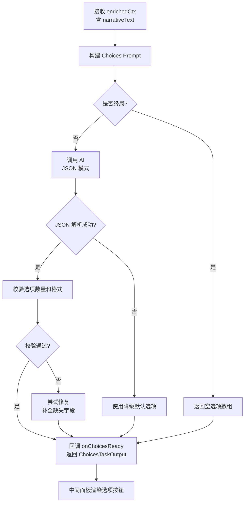
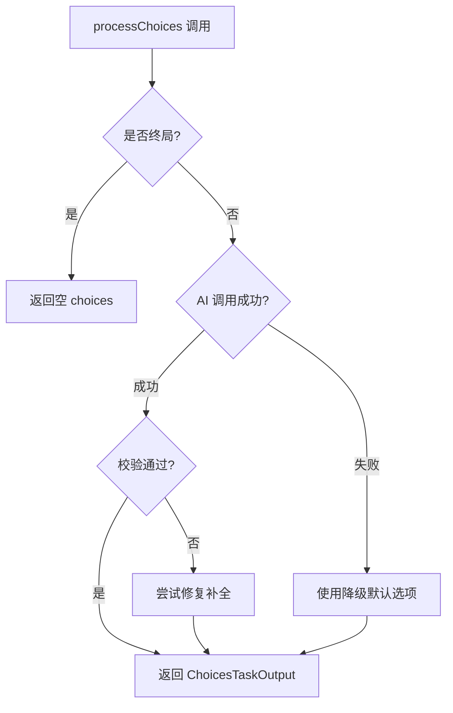

# AI Task 4 — 回合选项生成（中间面板）

> **调度阶段：Phase B-3（与 Task 1、Task 2 并行）**
> **对应面板：中间叙事面板·选项区域**
> **文件：`services/choicesTask.ts`**

------

## 1. 任务定位

本 Task 是 Phase B 中的第三个并行任务，负责**基于叙事结果生成决策选项**。它接收 Task 3 输出的叙事文本作为核心上下文，确保选项与叙事高度相关。

```
                                  ┌─► Task 1 (现实映射)  Phase B-1
Task 3 (纯叙事) ─► narrativeText ─┼─► Task 2 (世界法则)  Phase B-2
                                  └─► Task 4 (选项生成)  Phase B-3  ← 本文档
```

### 为什么要独立成 Task？

| 理由 | 说明 |
|------|------|
| 职责分离 | 叙事生成（创意写作）和选项设计（策略平衡）是完全不同的 AI 能力 |
| 独立调优 | 选项生成可以使用更高 temperature 提升多样性，而叙事需要较低 temperature 保持连贯 |
| 并行加速 | 与 Task 1/2 并行执行，不额外增加总耗时 |
| 拿到叙事上下文 | 在叙事完成后执行，选项能精确贴合当前场景 |

------

## 2. 流程图



------

## 3. 输入接口

```typescript
interface ChoicesTaskInput {
  // 来自 enrichedCtx（TurnContext + narrativeText）
  playerAction: string;                    // 玩家选择的文本
  narrativeText: string;                   // ★ 来自 Task 3 的叙事输出
  character: Character;                    // 完整角色信息
  currentStats: {
    credibility: number;
    stress: number;
    connections: number;
  };
  activeRulesTitles: string[];             // 仅规则标题，减少 token
  turnCount: number;
  maxTurns: number;
  isFinalTurn: boolean;                    // turnCount >= maxTurns
}
```

### Token 优化策略

| 字段 | 优化 |
|------|------|
| `narrativeText` | 原文传入（150-300字），不截断 |
| `activeRulesTitles` | 仅传标题数组而非完整 RuleCard 对象 |
| `character` | 仅提取 name/title/weakness 三个字段进入 prompt |

------

## 4. 输出 Schema

```typescript
interface ChoicesTaskOutput {
  choices: Array<{
    id: string;                    // 唯一标识 e.g. 'opt1', 'opt2', 'opt3'
    text: string;                  // 选项文案（10-30字）
    consequence: string;           // 后果描述
    cost?: string;                 // 代价（可选）
    risk?: string;                 // 风险（可选）
    strategy?: string;             // 策略维度标签（如"武力"/"智慧"/"社交"）
  }>;
}
```

### Gemini responseSchema 定义

```typescript
const choicesResponseSchema = {
  type: Type.OBJECT,
  properties: {
    choices: {
      type: Type.ARRAY,
      items: {
        type: Type.OBJECT,
        properties: {
          id: { type: Type.STRING },
          text: { type: Type.STRING },
          consequence: { type: Type.STRING },
          cost: { type: Type.STRING },
          risk: { type: Type.STRING },
          strategy: { type: Type.STRING }
        }
      }
    }
  }
};
```

------

## 5. System Prompt

```
你是「命运岔路引擎」，负责基于当前叙事场景为暗黑奇幻 TRPG 游戏"人格编年史"生成高质量决策选项。

## 选项生成要求

1. 正常回合生成 **3 个差异化选项**
2. 每个选项必须包含：
   - `id`（唯一标识，如 'opt1', 'opt2', 'opt3'）
   - `text`（选项文案，10-30字，简体中文）
   - `consequence`（后果提示，简短明确）
3. 选项应覆盖不同策略维度（用 `strategy` 标注）：
   - 武力/直接对抗
   - 智慧/策略/欺骗
   - 社交/魅力/谈判
   - 逃避/隐匿/观望（可选第四项）
4. 标注 `cost`（代价）和 `risk`（风险），帮助玩家做出知情决策
5. 选项之间的风险梯度应有明显差异：
   - 必须有一个低风险保守选项
   - 必须有一个高风险高回报选项
6. 选项必须与叙事场景紧密相关，不可脱离上下文
7. 选项文案要有暗黑奇幻风格，避免过于直白

## 上下文利用

- 仔细阅读 [叙事文本]，选项必须是叙事场景的合理延续
- 参考角色弱点，至少一个选项应与弱点相关
- 参考当前属性值，高压力/低信誉时选项应反映困境

## 禁止

- 不生成叙事文本（Task 3 已完成）
- 不评估属性变化（Task 1 负责）
- 不判定规则触发（Task 2 负责）
- 终局回合不生成选项（返回空 choices 数组）
- 不输出与 JSON schema 无关的内容
```

------

## 6. User Prompt 模板

```typescript
const buildChoicesPrompt = (input: ChoicesTaskInput): string => `
[角色]
${input.character.name}（${input.character.title}）
弱点: ${input.character.weakness}

[当前状态]
回合: ${input.turnCount} / ${input.maxTurns}
信誉: ${input.currentStats.credibility}/10
压力: ${input.currentStats.stress}/10
人脉: ${input.currentStats.connections}/10

[激活规则]
${input.activeRulesTitles.map(t => `• ${t}`).join('\n')}

[叙事文本]
"${input.narrativeText}"

[玩家上一步行为]
"${input.playerAction}"

[指令]
${input.isFinalTurn
  ? '这是终局回合。不生成选项，返回空的 choices 数组。'
  : '基于上述叙事场景，生成 3 个差异化决策选项。每个选项标注策略维度、代价和风险。'}
`;
```

------

## 7. 渲染模式：JSON 直出

Task 4 **不使用 streaming**，直接使用 `generateContent` 的 JSON 模式获取结构化输出。

### 原因

| 原因 | 说明 |
|------|------|
| 输出短小 | 3 个选项 JSON 一般 < 200 tokens，无需逐字渲染 |
| 结构化需求 | 选项需要完整 JSON 结构才能渲染为按钮 |
| 用户感知 | 叙事 streaming 已提供等待内容，选项稍后出现是自然体验 |

### 实现伪代码

```typescript
export async function processChoices(
  ctx: EnrichedTurnContext
): Promise<ChoicesTaskOutput> {
  
  // 终局回合直接返回空选项
  if (ctx.isGameOver) {
    return { choices: [] };
  }

  const input = buildChoicesInput(ctx);
  const prompt = buildChoicesPrompt(input);

  try {
    const response = await generateContent(ctx.providerConfig, {
      prompt,
      systemInstruction: CHOICES_SYSTEM_PROMPT,
      jsonSchema: choicesResponseSchema,
      jsonMode: true,
      // 较高 temperature 提升选项多样性
      temperature: 0.9,
    });
    
    const parsed = JSON.parse(response) as ChoicesTaskOutput;
    return validateAndFixChoices(parsed);
  } catch (e) {
    console.error('Choices Task failed, using fallback:', e);
    return FALLBACK_CHOICES;
  }
}

function validateAndFixChoices(output: ChoicesTaskOutput): ChoicesTaskOutput {
  // 确保有 3 个选项
  if (!output.choices || output.choices.length === 0) {
    return FALLBACK_CHOICES;
  }
  
  // 确保每个选项有 id 和 text
  output.choices = output.choices.map((c, i) => ({
    id: c.id || `opt${i + 1}`,
    text: c.text || '未知选项',
    consequence: c.consequence || '后果未知',
    cost: c.cost,
    risk: c.risk,
    strategy: c.strategy,
  }));
  
  return output;
}
```

------

## 8. 降级策略



### 降级输出

```typescript
const FALLBACK_CHOICES: ChoicesTaskOutput = {
  choices: [
    {
      id: 'retry',
      text: '试图修补现实的裂缝',
      consequence: '重试上一步行动',
      risk: '时间流逝',
      strategy: '智慧',
    },
    {
      id: 'wait',
      text: '静待命运的织线重新编织',
      consequence: '跳过本轮等待变化',
      risk: '错失机会',
      strategy: '观望',
    },
    {
      id: 'embrace',
      text: '拥抱混沌中的未知',
      consequence: '触发随机事件',
      risk: '不可预测',
      strategy: '冒险',
    },
  ],
};
```

------

## 9. Store 交互

### 涉及的状态

```typescript
// 新增
choicesLoading: boolean;            // Phase B-3 loading 指示器

// 复用
currentStory: StoryNode | null;     // Task 4 完成后补充 choices 字段
```

### 状态流转

```
Phase A 完成 (onNarrativeReady)
  └─ set choicesLoading = true
  └─ set currentStory = { text: narrativeText, choices: [] }

onChoicesReady(result) 回调
  └─ set currentStory.choices = result.choices
  └─ set choicesLoading = false
```

------

## 10. UI 渲染规则

### 选项 Loading 阶段（叙事完成后，Task 4 进行中）

```
┌──────────────────────────────────────────────┐
│                                              │
│  "你推开了腐朽的橡木门..."                       │
│  (完整叙事文本，已由 Task 3 渲染)                │
│                                              │
│  ┌─────────────────────────────────────┐     │
│  │   ☉ 命运正在编织你的选择...           │     │
│  │   (choicesLoading 动画)             │     │
│  └─────────────────────────────────────┘     │
│                                              │
└──────────────────────────────────────────────┘
```

### 选项 完成阶段

```
┌──────────────────────────────────────────────┐
│                                              │
│  "你推开了腐朽的橡木门..."                       │
│  (完整叙事文本)                                 │
│                                              │
│  ┌─────────────────────────────────────┐     │
│  │ ▸ 选项 1: 与守卫谈判     [社交]      │     │
│  │   代价: 记忆  风险: 被识破             │     │
│  └─────────────────────────────────────┘     │
│  ┌─────────────────────────────────────┐     │
│  │ ▸ 选项 2: 翻窗潜入       [智慧]      │     │
│  │   代价: 体力  风险: 摔伤             │     │
│  └─────────────────────────────────────┘     │
│  ┌─────────────────────────────────────┐     │
│  │ ▸ 选项 3: 强行突破       [武力]      │     │
│  │   代价: 信誉  风险: 受伤             │     │
│  └─────────────────────────────────────┘     │
│                                              │
└──────────────────────────────────────────────┘
```

------

## 11. AI 参数配置

| 参数 | 值 | 说明 |
|------|---|------|
| temperature | 0.9 | 较高值提升选项多样性和创意性 |
| maxOutputTokens | 512 | 3 个选项 JSON 绰绰有余 |
| jsonMode | true | 直接输出结构化 JSON |
| 超时阈值 | 15s | Phase B 各 Task 超时阈值（比 Phase A 短） |

------

## 12. 性能指标

| 指标 | 目标值 |
|------|--------|
| 完整选项生成时间 | < 5s |
| Token 消耗 (input) | < 500 tokens |
| Token 消耗 (output) | < 200 tokens |
| 超时阈值 | 15s |

------

## 13. 测试用例

| # | 场景 | 预期 |
|---|------|------|
| 1 | 正常回合 | 返回 3 个选项，每个有 id/text/consequence |
| 2 | 终局回合 | 返回空 choices 数组 |
| 3 | AI 异常 | 返回 FALLBACK_CHOICES（3 个默认选项） |
| 4 | JSON 格式错误 | 尝试修复后返回，或降级 |
| 5 | 选项缺少字段 | 自动补全 id/text/consequence 默认值 |
| 6 | 超时 15s | 使用 FALLBACK_CHOICES |
| 7 | narrativeText 为空 | 仍然生成通用选项（基于角色和属性） |
| 8 | 高压力低信誉 | 选项反映困境，至少一个与弱点相关 |
