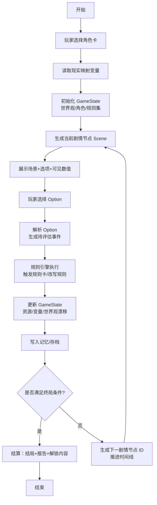
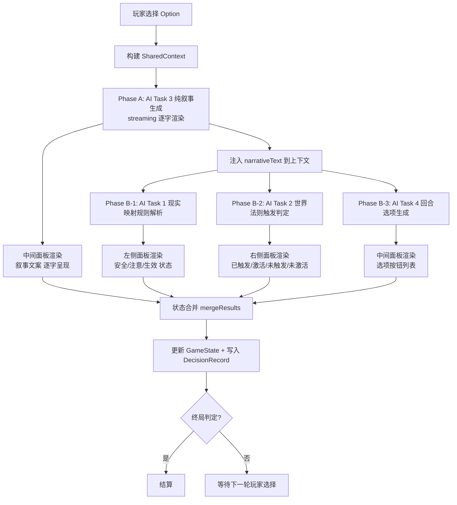

先给你一个**能直接映射到现有无循环节点规则系统**的决策流程图，然后把每个节点讲清楚你在代码里该挂哪一块逻辑。

------

## 1. 决策流程图（文字 + Mermaid）

### 文本版流程（单局一条主线，靠状态推进，不靠图结构循环）

1. **开始**
2. 玩家选择【角色卡（Persona）】
3. 读取 / 推断当前【现实映射变量】（信誉、时间压力、社交资本等）
4. 初始化【游戏状态 GameState】
   - 世界观骨架实例化
   - 角色状态初始化
   - 规则集 = 基础规则集 + 角色规则偏置 + 现实映射修正
5. 生成【当前剧情节点 Scene】
   - 根据 GameState & 规则集，选一个“场景模板 + 决策点”
6. 向玩家展示：
   - 场景叙事文案
   - 可选项列表（Decision Options）
   - 关键可见数值（资源/信誉等）
7. 玩家做出【选择】
8. 将【选择】翻译成一组“待评估事件”：
   - 触发标签（tag）
   - 影响目标（资源/变量）
   - 候选规则卡列表
9. 规则引擎执行：
   - 按顺序检查规则卡触发条件
   - 应用效果 / 代价 / 反制
   - 标记可改写字段（对后续规则集做增删改）
10. 更新【GameState】：
    - 资源、关系、现实映射变量、世界观漂移、角色弧线
    - 记录本轮选择 & 规则触发日志
11. 写入【记忆 / 存档条目】
12. 判定【是否终局】
    - 若满足结局条件：进入结算
    - 否则：生成“下一剧情节点 ID”并推进时间线（SceneIndex + 1）
13. 【结算】：
    - 输出结局文本
    - 输出本局关键规则改写 / 角色成长 / 世界观变化
    - 解锁新角色卡 / 规则卡 / 世界观片段
14. 结束

------

### Mermaid 流程图（适配“无循环节点”的实现方式）



> **说明：**
>
> - 在代码层面，你不需要“图结构的循环边”，只要在 `N` 步生成一个新的 Scene 节点 ID（或索引）再回到 `E`；
> - 也就是：**流程有逻辑循环，但数据结构依然是一个“无环节点链表 / 有序数组”**，和你现在的无循环节点规则系统兼容。

------

## 2. 节点到系统模块的映射（方便你对号入座）

你可以直接把下面当成“代码里要有的 handler 列表”：

1. **角色选择层**
   - 对应：`selectPersona()`
   - 输出：`persona_id`、`persona_bias`（规则偏置）、`初始动机标签`
2. **现实映射层**
   - 对应：`readRealityContext()`
   - 输入：玩家预设 / 外部参数 / 随机
   - 输出：`reality_vars`（信誉、时间债、合规压力…）
3. **初始化 GameState**
   - 对应：`initGameState(persona, reality_vars)`
   - 组装：
     - `world_state`（世界观骨架实例化）
     - `role_state`（角色属性、动机）
     - `ruleset` = 基础规则 + Persona 偏置 + 现实修正
4. **剧情节点生成**
   - 对应：`generateScene(game_state, ruleset)`
   - 输出：`scene_id`、`scene_text`、`options[]`、`visible_stats`
5. **玩家决策 & 事件解析**
   - 对应：`applyPlayerChoice(scene_id, option_id)`
   - 输出：`events[]`（用于驱动规则引擎）
6. **规则引擎执行**
   - 对应：`runRules(events, ruleset, game_state)`
   - 完成：
     - 触发规则卡
     - 计算效果/代价
     - 改写规则集（增删改规则卡文本/参数）
7. **状态更新 + 记忆**
   - 对应：`updateState(game_state, rule_results)`
   - 对应：`appendMemoryLog(entry)`
8. **终局判定 & 结算**
   - 对应：`checkEnd(game_state)` → bool / 结局类型
   - 对应：`settleGame(game_state, memory_log)` → 结局报告 / 解锁内容
9. **生成下一节点（无环实现的关键）**
   - 对应：`planNextScene(game_state)`
   - 输出：`next_scene_id` 或 `scene_index + 1`
   - 再交回 `generateScene()`，形成“线性推进的伪循环”。

------

基于这个流程， 设计更贴近你现有代码结构的节点 ID / 状态结构体设计**， 这个流 实现

------

## 3. AI 任务拆分方案：四路调度处理架构

### 3.0 设计动机

当前 `geminiService.processTurn()` 使用**单次 AI 调用**完成所有逻辑（叙事生成 + 属性计算 + 规则触发判定 + 选项生成），存在以下问题：

| 问题 | 影响 |
|------|------|
| 单点阻塞 | 一个 prompt 过长，延迟高，Token 浪费大 |
| 职责耦合 | 规则解析、世界法则判定、选项生成逻辑混在一个 prompt 里，AI 输出不稳定 |
| 无法增量渲染 | 三个面板必须等同一个响应完成才能更新 |
| 难以独立调优 | 无法单独为"规则解析"或"选项生成"微调 prompt / temperature |

**目标：** 将当前 `processTurn` 拆分为 **4 个独立 AI Task**，采用 **「叙事优先 → 三翼并行」** 的串并联调度策略：

1. **Phase A**：先执行 AI Task 3（纯叙事生成），中间面板流式输出
2. **Phase B**：叙事完成后，将叙事结果注入上下文，**并行**发起：
   - AI Task 1（现实映射规则解析）
   - AI Task 2（世界法则触发判定）
   - AI Task 4（回合选项生成）

这样做的关键好处：
- Task 1 / Task 2 / Task 4 都能拿到**叙事文本**作为额外上下文，判定和选项生成更精准
- 叙事流式渲染让用户在等待时就能阅读故事，体感延迟大幅降低
- Phase B 三个 Task 互不依赖，完全并行不阻塞
- 选项生成独立后可以单独调优 prompt / temperature，提升选项质量和多样性

> 每个 Task 的详细流程文档见：
> - [Task 3 — 回合叙事生成](./task3-narrative.md)（Phase A，最先执行）
> - [Task 1 — 现实映射规则解析](./task1-reality-mapping.md)（Phase B-1）
> - [Task 2 — 世界法则触发判定](./task2-world-rules.md)（Phase B-2）
> - [Task 4 — 回合选项生成](./task4-choices.md)（Phase B-3）

------

### 3.1 架构总览

```
┌─────────────────────────────────────────────────────────────────┐
│                    handleChoice() 入口                          │
│  构建 sharedContext（角色/属性/规则/历史/玩家选择）                  │
└────────────────────────┬────────────────────────────────────────┘
                         │
                         ▼
              ┌─────────────────────┐
              │    Phase A          │
              │    AI Task 3        │
              │    纯叙事生成        │
              │    (支持 streaming)  │
              └──────────┬──────────┘
                         │ 叙事完成，注入 narrativeText
                         │
           ┌─────────────┼─────────────┐
           │             │             │
           ▼             ▼             ▼
   ┌─────────────┐ ┌─────────────┐ ┌─────────────┐
   │  Phase B-1  │ │  Phase B-2  │ │  Phase B-3  │
   │  AI Task 1  │ │  AI Task 2  │ │  AI Task 4  │
   │  现实映射    │ │  世界法则    │ │  选项生成    │
   │  规则解析    │ │  触发判定    │ │  决策选项    │
   └──────┬──────┘ └──────┬──────┘ └──────┬──────┘
          │              │              │
          ▼              ▼              ▼
   ┌─────────────┐ ┌─────────────┐ ┌─────────────┐
   │  左侧面板    │ │  右侧面板    │ │  中间面板    │
   │  实时更新    │ │  实时更新    │ │  选项按钮    │
   └──────┬──────┘ └──────┬──────┘ └──────┬──────┘
          │              │              │
          └──────────────┼──────────────┘
                         ▼
              ┌───────────────┐
              │  状态合并层    │
              │  mergeResults │
              └───────────────┘
```



------

### 3.2 AI Task 1 — 现实映射规则解析（左侧面板）

**职责：** 分析玩家行为对现实映射变量（信誉/压力/人脉）的影响，自动解析阈值，输出每个属性的安全/注意/生效状态。

#### 3.2.1 输入（Prompt Context）

```typescript
interface RealityMappingTaskInput {
  playerAction: string;                    // 玩家选择文本
  currentStats: Record<StatKey, number>;   // 当前三维属性
  activeRules: RuleCard[];                 // 当前激活规则（仅含现实映射相关）
  characterWeakness: string;               // 角色弱点
  sceneSummary: string;                    // 当前场景摘要
}
```

#### 3.2.2 输出 Schema

```typescript
interface RealityMappingTaskOutput {
  statUpdates: {
    credibility: number;   // 增量 e.g. -1
    stress: number;        // 增量 e.g. +2
    connections: number;   // 增量 e.g. -1
  };
  statAnalysis: Array<{
    statKey: StatKey;
    newValue: number;           // 计算后的值
    status: 'safe' | 'warning' | 'triggered';
    threshold: number | null;
    warningMessage: string;     // 中文提示
    reason: string;             // 变化原因
  }>;
}
```

#### 3.2.3 System Prompt（专用）

```
你是「现实映射分析引擎」，负责评估玩家行为对三维现实属性的影响。

规则：
- 信誉度 (credibility): 0-10，<3 为触发阈值（NPC敌意），<5 为注意
- 精神压力 (stress): 0-10，>8 为触发阈值（幻觉），>6 为注意
- 人脉 (connections): 0-10，<2 为触发阈值（孤立），<4 为注意

输出要求：
1. 基于玩家行为和当前规则集，计算每个属性的增量变化
2. 计算变化后的新值，判定 safe/warning/triggered 状态
3. 给出中文变化原因和警告信息
4. 输出语言：简体中文
```

#### 3.2.4 UI 更新策略

- 收到响应后**立即**更新左侧 `RealityMappingPanel`
- 为每个属性条设置颜色编码：`safe=绿` / `warning=黄` / `triggered=红`
- Store 新增 `realityAnalysisLoading: boolean` 控制局部 loading 动画
- 不阻塞中间面板和右侧面板渲染

#### 3.2.5 对应代码变更

| 文件 | 变更 |
|------|------|
| `services/realityMappingTask.ts` | **新增**，独立 AI 任务函数 |
| `types.ts` | 新增 `RealityMappingTaskOutput` 接口 |
| `store/index.ts` | 新增 `realityAnalysis` 状态 + `realityAnalysisLoading` |
| `components/RealityMappingPanel.tsx` | 接入 AI 返回的 `statAnalysis` 替代纯客户端解析 |
| `utils/ruleParser.ts` | 保留作为 fallback，AI 失败时降级为客户端解析 |

------

### 3.3 AI Task 2 — 世界法则触发判定（右侧面板）

**职责：** 判定所有规则卡在当前行为下的触发状态，管理规则的激活/休眠/新增/移除。

#### 3.3.1 输入（Prompt Context）

```typescript
interface WorldRulesTaskInput {
  playerAction: string;
  allRules: RuleCard[];                    // 所有规则（含激活和休眠）
  currentStats: Record<StatKey, number>;
  turnCount: number;
  historySummary: string;                  // 最近历史摘要
}
```

#### 3.3.2 输出 Schema

```typescript
interface WorldRulesTaskOutput {
  triggeredRules: Array<{
    ruleId: string;
    ruleTitle: string;
    reason: string;         // 触发原因
  }>;
  ruleUpdates: {
    activate: string[];     // 从休眠→激活的规则 ID
    deactivate: string[];   // 从激活→休眠的规则 ID
    add: Array<{
      id: string;
      title: string;
      type: 'CONSTRAINT' | 'BONUS' | 'RISK' | 'REALITY';
      description: string;
      active: boolean;
    }>;
    removeIds: string[];    // 永久移除的规则 ID
  };
  ruleStatusMap: Record<string, 'triggered' | 'active_not_triggered' | 'inactive'>;
}
```

#### 3.3.3 System Prompt（专用）

```
你是「世界法则裁定引擎」，负责判定所有规则卡的触发状态。

规则状态定义：
- triggered（已触发）：本轮玩家行为满足触发条件，规则生效
- active_not_triggered（激活未触发）：规则处于激活状态但本轮未被触发
- inactive（未激活）：规则处于休眠状态

你的职责：
1. 逐条检查所有规则，判定是否被当前玩家行为触发
2. 被触发的规则必须说明触发原因
3. 根据剧情发展，可以：激活休眠规则 / 休眠激活规则 / 新增规则 / 移除规则
4. 新增的规则必须符合暗黑奇幻塔罗美学
5. 输出语言：简体中文
```

#### 3.3.4 UI 更新策略

- 收到响应后**立即**更新右侧规则面板
- 四种视觉状态映射：
  - `triggered` → 黄色高亮 + ⚡已触发 badge + 脉冲动画
  - `active_not_triggered` → 绿色 badge「激活」
  - `inactive` → 灰色 badge「休眠」
  - 新增规则 → 入场动画 + ✨新增标记
- Store 新增 `worldRulesLoading: boolean`
- 排序：triggered 置顶 → active → inactive

#### 3.3.5 对应代码变更

| 文件 | 变更 |
|------|------|
| `services/worldRulesTask.ts` | **新增**，独立 AI 任务函数 |
| `types.ts` | 新增 `WorldRulesTaskOutput` 接口 |
| `store/index.ts` | 新增 `ruleStatusMap` + `worldRulesLoading` |
| `components/RuleCard.tsx` | 接入 `ruleStatusMap` 渲染四状态 |
| `utils/ruleValidator.ts` | 保留作为 fallback + 结果校验 |

------

### 3.4 AI Task 3 — 纯叙事生成（中间面板·Phase A）

**职责：** 生成本轮叙事文案，专注于故事质量和沉浸感。**不生成选项**（选项由 Task 4 独立负责）。

#### 3.4.1 输入（Prompt Context）

```typescript
interface NarrativeTaskInput {
  playerAction: string;
  character: Character;
  currentStats: Record<StatKey, number>;
  activeRulesTitles: string[];             // 仅传标题，减少 token
  historySummary: string;
  turnCount: number;
  maxTurns: number;
  isFinalTurn: boolean;
}
```

#### 3.4.2 输出 Schema

```typescript
interface NarrativeTaskOutput {
  text: string;                  // 叙事段落（简体中文）
  isGameOver: boolean;
  gameSummary?: string;          // 仅终局时
  mood?: string;                 // 场景氛围标签（可选，供 Task 4 参考）
}
```

#### 3.4.3 System Prompt（专用）

```
你是「命运叙事引擎」，负责为暗黑奇幻 TRPG 游戏生成沉浸式叙事。

叙事要求：
1. 风格：暗黑奇幻 + 塔罗美学 + 写实残酷
2. 每段叙事 150-300 字，第二人称沉浸
3. 必须体现玩家行为的直接后果
4. 包含感官描写（视觉/听觉/嗅觉），增强临场感
5. 语言：简体中文

终局规则：
- 终局回合设置 isGameOver: true，输出 gameSummary（200字以内）

禁止：
- 不生成选项（选项由独立 Task 负责）
- 不评估属性变化（Task 1 负责）
- 不判定规则触发（Task 2 负责）
```

#### 3.4.4 UI 更新策略

- 支持**流式渲染**（`generateStream`）逐字呈现叙事文案
- 叙事完成后，中间面板显示"选项生成中..." loading（等待 Task 4）
- 选项由 Task 4 完成后再渲染到中间面板
- Store 新增 `narrativeLoading: boolean`

#### 3.4.5 对应代码变更

| 文件 | 变更 |
|------|------|
| `services/narrativeTask.ts` | **新增**，纯叙事 AI 任务（支持 streaming，不含选项） |
| `types.ts` | 新增 `NarrativeTaskOutput` 接口（不含 choices） |
| `store/index.ts` | 新增 `narrativeLoading` + `narrativeStreamBuffer` |
| `App.tsx` 中间面板 | 接入 streaming 渲染 + 独立 loading 状态 |

------

### 3.5 AI Task 4 — 回合选项生成（中间面板·Phase B-3）

**职责：** 基于叙事结果生成下一步决策选项，专注于选项质量、策略多样性和风险梯度。

#### 3.5.1 输入（Prompt Context）

```typescript
interface ChoicesTaskInput {
  playerAction: string;
  narrativeText: string;                   // ★ 来自 Task 3 的叙事结果
  character: Character;
  currentStats: Record<StatKey, number>;
  activeRulesTitles: string[];             // 仅传标题
  turnCount: number;
  maxTurns: number;
  isFinalTurn: boolean;
}
```

#### 3.5.2 输出 Schema

```typescript
interface ChoicesTaskOutput {
  choices: Array<{
    id: string;
    text: string;                // 选项文案
    consequence: string;         // 后果提示
    cost?: string;               // 代价
    risk?: string;               // 风险
    strategy?: string;           // 策略维度标签
  }>;
}
```

#### 3.5.3 System Prompt（专用）

```
你是「命运岔路引擎」，负责基于当前叙事场景生成高质量决策选项。

选项要求：
1. 正常回合生成 3 个差异化选项
2. 每个选项必须有：文案(text) + 后果(consequence)
3. 选项应覆盖不同策略维度：
   - 武力/直接对抗
   - 智慧/策略/欺骗
   - 社交/魅力/谈判
4. 标注代价(cost)和风险(risk)，使玩家做出知情决策
5. 选项之间的风险梯度应有明显差异
6. 选项必须与叙事场景紧密相关，不可脱离上下文
7. 语言：简体中文

禁止：
- 不生成叙事文本（Task 3 已完成）
- 不评估属性变化（Task 1 负责）
- 不判定规则触发（Task 2 负责）
- 终局回合不生成选项（返回空数组）
```

#### 3.5.4 UI 更新策略

- 叙事 streaming 完成后，中间面板进入"选项生成中..." loading
- Task 4 完成后，选项按钮渲染到中间面板叙事文案下方
- Store 新增 `choicesLoading: boolean`

#### 3.5.5 对应代码变更

| 文件 | 变更 |
|------|------|
| `services/choicesTask.ts` | **新增**，独立选项生成 AI 任务 |
| `types.ts` | 新增 `ChoicesTaskOutput` 接口 |
| `store/index.ts` | 新增 `choicesLoading` |
| `App.tsx` 中间面板 | 选项区域独立 loading，Task 4 完成后渲染 |

------

### 3.6 并行调度层设计

#### 3.6.1 新增 `services/turnOrchestrator.ts`

```typescript
import { processRealityMapping } from './realityMappingTask';
import { processWorldRules } from './worldRulesTask';
import { processNarrative } from './narrativeTask';
import { processChoices } from './choicesTask';

interface TurnContext {
  playerAction: string;
  character: Character;
  allRules: RuleCard[];
  currentStats: Record<StatKey, number>;
  historySummary: string;
  turnCount: number;
  maxTurns: number;
  providerConfig: AIProviderConfig;
}

interface TurnResult {
  realityMapping: RealityMappingTaskOutput | null;
  worldRules: WorldRulesTaskOutput | null;
  narrative: NarrativeTaskOutput | null;
  choices: ChoicesTaskOutput | null;
  errors: string[];
}

export async function orchestrateTurn(
  ctx: TurnContext,
  callbacks: {
    onRealityMappingReady: (result: RealityMappingTaskOutput) => void;
    onWorldRulesReady: (result: WorldRulesTaskOutput) => void;
    onNarrativeReady: (result: NarrativeTaskOutput) => void;
    onChoicesReady: (result: ChoicesTaskOutput) => void;
    onNarrativeStream?: (chunk: string) => void;
  }
): Promise<TurnResult> {
  
  const errors: string[] = [];
  let narrativeOutput: NarrativeTaskOutput | null = null;

  // ═══════════════════════════════════════════
  // Phase A：先执行纯叙事任务（支持 streaming）
  //          不生成选项，仅输出叙事文本
  // ═══════════════════════════════════════════
  try {
    narrativeOutput = await processNarrative(ctx, callbacks.onNarrativeStream);
    callbacks.onNarrativeReady(narrativeOutput);
  } catch (e: any) {
    errors.push(`Narrative Task Failed: ${e.message}`);
  }

  // ═══════════════════════════════════════════
  // Phase B：叙事完成后，将叙事文本注入上下文，
  //          并行发起 现实映射 + 世界法则 + 选项生成
  // ═══════════════════════════════════════════
  const enrichedCtx = {
    ...ctx,
    narrativeText: narrativeOutput?.text || '',  // 注入叙事文本
    isGameOver: narrativeOutput?.isGameOver || false,
  };

  const [realityResult, rulesResult, choicesResult] = await Promise.allSettled([
    processRealityMapping(enrichedCtx).then(r => {
      callbacks.onRealityMappingReady(r);
      return r;
    }),
    processWorldRules(enrichedCtx).then(r => {
      callbacks.onWorldRulesReady(r);
      return r;
    }),
    processChoices(enrichedCtx).then(r => {
      callbacks.onChoicesReady(r);
      return r;
    }),
  ]);

  if (realityResult.status === 'rejected') {
    errors.push(`Reality Mapping Failed: ${(realityResult as PromiseRejectedResult).reason?.message}`);
  }
  if (rulesResult.status === 'rejected') {
    errors.push(`World Rules Failed: ${(rulesResult as PromiseRejectedResult).reason?.message}`);
  }
  if (choicesResult.status === 'rejected') {
    errors.push(`Choices Task Failed: ${(choicesResult as PromiseRejectedResult).reason?.message}`);
  }

  return {
    realityMapping: realityResult.status === 'fulfilled' 
      ? realityResult.value : null,
    worldRules: rulesResult.status === 'fulfilled' 
      ? rulesResult.value : null,
    narrative: narrativeOutput,
    choices: choicesResult.status === 'fulfilled'
      ? choicesResult.value : null,
    errors,
  };
}
```

#### 3.6.2 调度时序

```mermaid
sequenceDiagram
    participant U as 用户点击选项
    participant O as turnOrchestrator
    participant T3 as AI Task 3 (纯叙事)
    participant T1 as AI Task 1 (现实映射)
    participant T2 as AI Task 2 (世界法则)
    participant T4 as AI Task 4 (选项生成)
    participant S as Store
    participant UI as 三栏 UI

    U->>O: handleChoice(choiceId, choiceText)
    O->>S: set narrativeLoading = true
    
    rect rgb(40, 30, 20)
    Note over O,T3: Phase A — 纯叙事优先
    O->>T3: processNarrative(ctx, onStream)
    T3-->>UI: streaming chunks → 逐字渲染叙事
    T3-->>O: NarrativeTaskOutput (text only)
    O->>S: update currentStory.text
    S-->>UI: 中间面板叙事渲染完成
    end

    O->>S: set realityLoading + rulesLoading + choicesLoading = true
    O->>O: 注入 narrativeText 到上下文

    rect rgb(30, 40, 30)
    Note over O,T4: Phase B — 三翼并行
    par 并行调度
        O->>T1: processRealityMapping(enrichedCtx)
        O->>T2: processWorldRules(enrichedCtx)
        O->>T4: processChoices(enrichedCtx)
    end
    
    T1-->>O: RealityMappingTaskOutput
    O->>S: update realityStats + statAnalysis
    S-->>UI: 左侧面板刷新 (safe/warning/triggered)
    
    T2-->>O: WorldRulesTaskOutput
    O->>S: update rules + ruleStatusMap
    S-->>UI: 右侧面板刷新 (triggered/active/inactive)
    
    T4-->>O: ChoicesTaskOutput
    O->>S: update currentStory.choices
    S-->>UI: 中间面板显示选项按钮
    end
    
    O->>O: mergeResults()
    O->>S: update decisionHistory + 终局判定
```



------

### 3.7 降级与容错策略

| 场景 | 降级方案 |
|------|---------|
| Task 3 失败 | 显示通用错误叙事 + Phase B 使用空叙事上下文继续 |
| Task 1 失败 | 使用客户端 `ruleParser.ts` 计算属性变化（增量 = 0） |
| Task 2 失败 | 使用客户端 `ruleValidator.ts` 判定触发（仅硬阈值） |
| Task 4 失败 | 生成 3 个默认通用选项（重试/等待/随机） |
| 全部失败 | 显示 "现实的织锦断裂了" 错误提示 + 重试按钮 |
| 部分超时 | 已完成的 Task 正常渲染，超时 Task 显示 loading → 30s 后降级 |

------

### 3.8 Store 状态扩展

```typescript
// store/index.ts 新增字段

interface GameStoreState extends GameState {
  // ... 现有字段 ...
  
  // Task 3: 纯叙事 (Phase A)
  narrativeLoading: boolean;
  narrativeStreamBuffer: string;  // 流式文本缓冲
  
  // Task 1: 现实映射 (Phase B-1)
  realityAnalysisLoading: boolean;
  realityAnalysis: RealityMappingTaskOutput['statAnalysis'] | null;
  
  // Task 2: 世界法则 (Phase B-2)
  worldRulesLoading: boolean;
  ruleStatusMap: Record<string, 'triggered' | 'active_not_triggered' | 'inactive'>;
  
  // Task 4: 选项生成 (Phase B-3)
  choicesLoading: boolean;
}
```

------

### 3.9 各 Task AI 配置设计

> **完整文档已独立为 → [task-ai-config.md](./task-ai-config.md)**
>
> 包含：`TaskAIConfig` / `TurnAIConfig` 接口设计、各 Task 默认预设（`DEFAULT_TASK_CONFIGS`）、配置对比表、设计决策说明、现有配置系统（`types.ts`/`store`/`aiEngine.ts`/`AiSettingsModal`）的全量分析与逐文件扩展方案、向后兼容迁移路径。

核心要点摘要：

| Task | temperature | streaming | jsonMode | timeout |
|------|------------|-----------|----------|---------|
| Task 3 叙事 | 0.75 | ✓ | ✗ | 30s |
| Task 1 现实映射 | 0.3 | ✗ | ✓ | 15s |
| Task 2 世界法则 | 0.3 | ✗ | ✓ | 15s |
| Task 4 选项生成 | 0.9 | ✗ | ✓ | 15s |

------

### 3.10 文件变更清单

| 操作 | 文件路径 | 说明 |
|------|---------|------|
| **新增** | `services/narrativeTask.ts` | AI Task 3：纯叙事生成（Phase A，streaming） |
| **新增** | `services/realityMappingTask.ts` | AI Task 1：现实映射规则解析（Phase B-1） |
| **新增** | `services/worldRulesTask.ts` | AI Task 2：世界法则触发判定（Phase B-2） |
| **新增** | `services/choicesTask.ts` | AI Task 4：回合选项生成（Phase B-3） |
| **新增** | `services/turnOrchestrator.ts` | 串并联调度层 + 结果合并 |
| **修改** | `types.ts` | 新增 4 个 TaskOutput 接口 + `TaskAIConfig` / `TurnAIConfig` |
| **修改** | `constants.ts` | 新增 `DEFAULT_TASK_CONFIGS` 各 Task AI 参数预设 |
| **修改** | `services/aiEngine.ts` | `generateContent` / `generateStream` 扩展接收 `TaskAIConfig` |
| **修改** | `store/index.ts` | 新增四路 loading + analysis 状态 + `taskConfigs` |
| **修改** | `App.tsx` | `handleChoice` → 调用 `orchestrateTurn`，面板独立 loading |
| **修改** | `components/RealityMappingPanel.tsx` | 接入 AI 分析结果，显示 safe/warning/triggered |
| **修改** | `components/RuleCard.tsx` | 接入 `ruleStatusMap`，四状态渲染 |
| **保留** | `services/geminiService.ts` | 保留原始单调用作为 fallback |
| **保留** | `utils/ruleParser.ts` | Task 1 降级使用 |
| **保留** | `utils/ruleValidator.ts` | Task 2 降级使用 |

------

### 3.11 实施路线

```
Phase 1 — 基础设施（预计 1 天）
  ├─ 定义 4 个 TaskOutput 类型到 types.ts
  ├─ 定义 TaskAIConfig / TurnAIConfig 接口到 types.ts
  ├─ 新增 DEFAULT_TASK_CONFIGS 到 constants.ts
  ├─ aiEngine.ts 扩展：generateContent / generateStream 接收 TaskAIConfig
  ├─ Store 扩展：四路 loading + analysis + taskConfigs 状态
  └─ 创建 turnOrchestrator.ts 骨架（串并联调度）

Phase 2 — Task 实现（预计 2.5 天）
  ├─ 【优先】实现 narrativeTask.ts + streaming（Phase A 核心，纯叙事）
  ├─ 实现 choicesTask.ts + 接收 narrativeText 上下文
  ├─ 实现 realityMappingTask.ts + 接收 narrativeText 上下文
  ├─ 实现 worldRulesTask.ts + 接收 narrativeText 上下文
  └─ 单元测试各 Task 的 JSON 解析

Phase 3 — 集成与 UI（预计 2 天）
  ├─ App.tsx handleChoice → orchestrateTurn（串并联）
  ├─ 中间面板 Phase A：streaming 纯叙事渲染
  ├─ 中间面板 Phase B：选项区域独立 loading → Task 4 完成后渲染
  ├─ RealityMappingPanel 接入 AI 分析结果（Phase B 阶段）
  ├─ RuleCard 接入 ruleStatusMap 四状态（Phase B 阶段）
  └─ 面板分阶段 loading 动画

Phase 4 — 容错与优化（预计 1 天）
  ├─ 各 Task 降级逻辑（含 Task 4 默认选项 fallback）
  ├─ 超时处理（Phase A: 30s, Phase B: 15s per task）
  ├─ Prompt token 优化
  └─ 端到端集成测试
```

------

### 3.12 各 Task 详细流程文档索引

| Task | 阶段 | 文档路径 | 说明 |
|------|------|---------|------|
| Task 3 — 纯叙事 | Phase A（最先执行） | [task3-narrative.md](./task3-narrative.md) | 流式纯叙事生成，为后续 Task 提供上下文 |
| Task 1 — 现实映射 | Phase B-1 | [task1-reality-mapping.md](./task1-reality-mapping.md) | 基于叙事结果分析属性变化与阈值状态 |
| Task 2 — 世界法则 | Phase B-2 | [task2-world-rules.md](./task2-world-rules.md) | 基于叙事结果判定规则触发与状态流转 |
| Task 4 — 选项生成 | Phase B-3 | [task4-choices.md](./task4-choices.md) | 基于叙事结果生成差异化决策选项 |