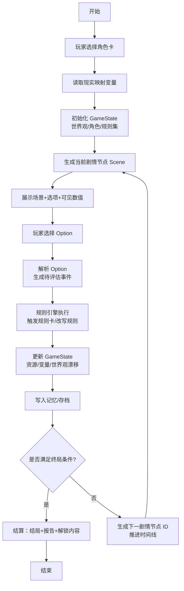

先给你一个**能直接映射到现有无循环节点规则系统**的决策流程图，然后把每个节点讲清楚你在代码里该挂哪一块逻辑。

------

## 1. 决策流程图（文字 + Mermaid）

### 文本版流程（单局一条主线，靠状态推进，不靠图结构循环）

1. **开始**
2. 玩家选择【角色卡（Persona）】
3. 读取 / 推断当前【现实映射变量】（信誉、时间压力、社交资本等）
4. 初始化【游戏状态 GameState】
   - 世界观骨架实例化
   - 角色状态初始化
   - 规则集 = 基础规则集 + 角色规则偏置 + 现实映射修正
5. 生成【当前剧情节点 Scene】
   - 根据 GameState & 规则集，选一个“场景模板 + 决策点”
6. 向玩家展示：
   - 场景叙事文案
   - 可选项列表（Decision Options）
   - 关键可见数值（资源/信誉等）
7. 玩家做出【选择】
8. 将【选择】翻译成一组“待评估事件”：
   - 触发标签（tag）
   - 影响目标（资源/变量）
   - 候选规则卡列表
9. 规则引擎执行：
   - 按顺序检查规则卡触发条件
   - 应用效果 / 代价 / 反制
   - 标记可改写字段（对后续规则集做增删改）
10. 更新【GameState】：
    - 资源、关系、现实映射变量、世界观漂移、角色弧线
    - 记录本轮选择 & 规则触发日志
11. 写入【记忆 / 存档条目】
12. 判定【是否终局】
    - 若满足结局条件：进入结算
    - 否则：生成“下一剧情节点 ID”并推进时间线（SceneIndex + 1）
13. 【结算】：
    - 输出结局文本
    - 输出本局关键规则改写 / 角色成长 / 世界观变化
    - 解锁新角色卡 / 规则卡 / 世界观片段
14. 结束

------

### Mermaid 流程图（适配“无循环节点”的实现方式）

> **说明：**
>
> - 在代码层面，你不需要“图结构的循环边”，只要在 `N` 步生成一个新的 Scene 节点 ID（或索引）再回到 `E`；
> - 也就是：**流程有逻辑循环，但数据结构依然是一个“无环节点链表 / 有序数组”**，和你现在的无循环节点规则系统兼容。

------

## 2. 节点到系统模块的映射（方便你对号入座）

你可以直接把下面当成“代码里要有的 handler 列表”：

1. **角色选择层**
   - 对应：`selectPersona()`
   - 输出：`persona_id`、`persona_bias`（规则偏置）、`初始动机标签`
2. **现实映射层**
   - 对应：`readRealityContext()`
   - 输入：玩家预设 / 外部参数 / 随机
   - 输出：`reality_vars`（信誉、时间债、合规压力…）
3. **初始化 GameState**
   - 对应：`initGameState(persona, reality_vars)`
   - 组装：
     - `world_state`（世界观骨架实例化）
     - `role_state`（角色属性、动机）
     - `ruleset` = 基础规则 + Persona 偏置 + 现实修正
4. **剧情节点生成**
   - 对应：`generateScene(game_state, ruleset)`
   - 输出：`scene_id`、`scene_text`、`options[]`、`visible_stats`
5. **玩家决策 & 事件解析**
   - 对应：`applyPlayerChoice(scene_id, option_id)`
   - 输出：`events[]`（用于驱动规则引擎）
6. **规则引擎执行**
   - 对应：`runRules(events, ruleset, game_state)`
   - 完成：
     - 触发规则卡
     - 计算效果/代价
     - 改写规则集（增删改规则卡文本/参数）
7. **状态更新 + 记忆**
   - 对应：`updateState(game_state, rule_results)`
   - 对应：`appendMemoryLog(entry)`
8. **终局判定 & 结算**
   - 对应：`checkEnd(game_state)` → bool / 结局类型
   - 对应：`settleGame(game_state, memory_log)` → 结局报告 / 解锁内容
9. **生成下一节点（无环实现的关键）**
   - 对应：`planNextScene(game_state)`
   - 输出：`next_scene_id` 或 `scene_index + 1`
   - 再交回 `generateScene()`，形成“线性推进的伪循环”。

------

基于这个流程， 设计更贴近你现有代码结构的节点 ID / 状态结构体设计**， 这个流 实现