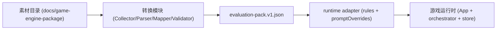

# 《任务规划说明》

## game-engine-package 接入“角色设定评价系统”执行方案（TypeScript）

## 假设

1. 假设当前目标运行时仍以 `/Users/dmeck/project/CharacterCard/types.ts` 中的数据结构为准，核心可读配置至少要落到 `RuleCard[]`、三维属性（`credibility/stress/connections`）和任务 Prompt 覆盖片段。
2. 假设 `symbol_engine*.json` 为主事实源，`/Users/dmeck/project/CharacterCard/docs/game-engine-package/data/*.md` 为补充语义源，允许存在字段不一致。
3. 假设允许新增独立转换模块与 CLI，不破坏现有 4-Task 编排（`/Users/dmeck/project/CharacterCard/services/turnOrchestrator.ts`）。
4. 假设 LLM 可通过当前 `gemini/openai` 配置调用（`/Users/dmeck/project/CharacterCard/services/aiEngine.ts`）。
5. 假设运行时当前实际消费统一包 `evaluation-pack.v1.json`，而不是直接读取 `docs/game-engine-package` 原始目录。

---

## 1. 目标定义

### 1.1 业务目标

1. 将 `game-engine-package` 产物稳定接入现有角色设定评价系统。
2. 支持“规则 JSON + Prompt/素材文档”统一转换，避免人工手改。
3. 保证后续上游技能产物可持续接入，不因版本波动反复改代码。
4. 统一团队对 Prompt/素材职责边界的理解，消除“运行时直读素材目录”的误解。

### 1.2 技术目标

1. 实现独立转换模块：输入包目录，输出项目可读统一包。
2. 建立“确定性解析 + LLM 语义映射 + Schema 校验 + 回退兜底”链路。
3. 提供源字段到目标字段的可追溯映射与审阅点。
4. 明确 Runtime Adapter 只从统一包提取 `rules` 与 `promptOverrides`。

### 1.3 验收目标

1. 单个包转换成功率 >= 95%。
2. 核心字段覆盖率 >= 98%（`engine_config/symbol_table/rules/state/outputs`）。
3. 转换后可直接驱动现有运行时完成至少 1 局完整回合流程（含规则触发和属性更新）。
4. 所有输出通过 JSON Schema 校验，关键字段有 source trace。
5. 文档与实现语义一致：不再出现“运行时直接消费 `docs/game-engine-package`”的描述。

---

## 2. 范围界定

### 2.1 Prompt/素材文档处理边界

| 层级 | 定义 | 输入 | 输出 | 责任 | 是否被运行时直接消费 |
| --- | --- | --- | --- | --- | --- |
| 源素材层 | 上游原始资产集合 | `docs/game-engine-package/*.md|*.json|*.mmd|*.txt` | 供转换模块解析的原始片段 | 提供事实与语义上下文 | 否 |
| 转换产物层 | 标准化后的统一协议包 | 源素材层 + 映射协议 | `evaluation-pack.v1.json`、`review-queue.json`、`conversion-report.md` | 字段归一、结构冻结、校验与追溯 | 否（仅统一包会进入运行时） |
| 运行时消费层 | 应用启动和回合编排 | `evaluation-pack.v1.json` | `rules`、`promptOverrides`、运行态缓存 | 加载统一包并注入游戏流程 | 是（仅消费统一包） |

**强制声明（不可省略）**

1. `/Users/dmeck/project/CharacterCard/docs/game-engine-package/*.md|*.json|*.mmd|*.txt` 是转换输入，不是运行时直接输入。
2. 运行时入口是统一包（默认 URL：`/engine-pack/evaluation-pack.v1.json`，见 `/Users/dmeck/project/CharacterCard/services/enginePackRuntime.ts`）。
3. Runtime Adapter（`/Users/dmeck/project/CharacterCard/services/enginePackConverter/runtimeAdapter.ts`）从统一包提取 `runtimeRuleCards -> rules`、`promptAssets -> promptOverrides`。



### 2.2 In Scope（可执行动作）

1. 实现并维护 `/Users/dmeck/project/CharacterCard/docs/game-engine-package` 全量文件解析与标准化。
2. 完成 `symbol_engine*.json` 到 `evaluation-pack.v1` 的协议映射与字段冻结。
3. 抽取 Markdown 资源中的 JSON 块，标准化 Prompt 资产与素材元数据。
4. 将统一包接入现有系统：`App.tsx`、`services/enginePackRuntime.ts`、`store/index.ts`、`services/turnOrchestrator.ts`。
5. 建立自动化测试、样本回归和验收报告，验证“统一包消费”语义。

### 2.3 Out of Scope（明确不做）

1. 不改造现有核心游戏循环和 UI 交互框架。
2. 不让运行时直接读取 `docs/game-engine-package` 原始目录。
3. 不改造上游技能本体，仅消费其导出产物。
4. 不引入多人联网或后端持久化重构。
5. 不在本任务中生成新视觉素材或外部资源下载器。

---

## 3. 术语表（Glossary）

| 术语 | 定义 |
| --- | --- |
| 源素材 | 上游交付的原始文件集合，路径位于 `docs/game-engine-package`。 |
| Prompt Assets | 从源素材中抽取并标准化后的 Prompt 片段（`system/constraints/examples`）。 |
| 转换产物 | 由转换模块输出的结构化结果，包含 `evaluation-pack.v1.json` 与审阅报告。 |
| 运行时配置 | 应用在运行时直接消费的配置对象，核心是 `rules` 与 `promptOverrides`。 |
| 统一包 | 指 `evaluation-pack.v1.json`，是运行时唯一允许的包级输入。 |

---

## 4. 现状与输入资产盘点

### 4.1 当前运行时事实链路（已核对实现）

1. `/Users/dmeck/project/CharacterCard/App.tsx` 启动时调用 `loadEnginePackFromUrl(resolveEnginePackUrl())`。
2. `/Users/dmeck/project/CharacterCard/services/enginePackRuntime.ts` 默认加载 `/engine-pack/evaluation-pack.v1.json`，并校验 `runtimeRuleCards`。
3. `/Users/dmeck/project/CharacterCard/services/enginePackConverter/runtimeAdapter.ts` 执行字段提取：  
   `runtimeRuleCards -> RuleCard[]`，`promptAssets -> TaskPromptOverrideMap`。
4. `/Users/dmeck/project/CharacterCard/store/index.ts` 保存 `enginePack`、`enginePackStatus`、`enginePackError`；开局优先使用 `enginePack.rules`，否则回退 `INITIAL_RULES`。
5. `/Users/dmeck/project/CharacterCard/services/turnOrchestrator.ts` 将 `promptOverrides` 注入四个任务；缺失覆盖时使用任务内置 base prompt。

### 4.2 输入资产盘点

| 资产类型 | 代表文件 | 结构化程度 | 用途 |
| --- | --- | --- | --- |
| 规则主 JSON | `/Users/dmeck/project/CharacterCard/docs/game-engine-package/data/symbol_engine_20260218_v2.0.json` | 高 | 主转换源（符号、变量、规则、状态、任务、输出索引） |
| 规则卡补充 | `/Users/dmeck/project/CharacterCard/docs/game-engine-package/data/02_rule_deck.md` | 中 | 命题边界/失败条件/rewrite hooks 补全 |
| O1-O5 输出样本 | `/Users/dmeck/project/CharacterCard/docs/game-engine-package/data/03_outputs_O1_O5.md` | 中 | fantasy knots/power chain/rewrite log/silence seeds 补全 |
| 数据结构规范 | `/Users/dmeck/project/CharacterCard/docs/game-engine-package/data/01_data_structures.md` | 中 | Schema 对齐、字段校验规则 |
| 概览与公理 | `/Users/dmeck/project/CharacterCard/docs/game-engine-package/data/data_summary.md`、`00_axiom_group.md` | 低-中 | 业务解释、术语归一 |
| Prompt 资源 | `/Users/dmeck/project/CharacterCard/docs/game-engine-package/game-engine-generator-prompt.md` | 低 | 转换为 `promptAssets` |
| 状态流图 | `/Users/dmeck/project/CharacterCard/docs/game-engine-package/charts/state_flow.mmd` | 中 | 状态机可视化和一致性检查 |
| 日志/理论参考 | `/Users/dmeck/project/CharacterCard/docs/game-engine-package/logs/rule_engine_pseudo.txt`、`references/engine-theory.md` | 低 | 解释性证据，非主数据源 |

---

## 5. 转换模块架构设计

### 5.1 模块边界

1. `Collector`：收集文件、识别类型、计算哈希。
2. `Parser`：JSON 直读，Markdown 分段与 fenced JSON 抽取，Mermaid 抽取。
3. `Normalizer`：统一为 `NormalizedEnginePack`。
4. `Mapper`：确定性字段映射 + LLM 语义映射（仅处理语义缺口）。
5. `Validator`：Schema 校验、跨字段校验、范围校验。
6. `Emitter`：输出 `evaluation-pack.v1.json`、`review-queue.json`、`conversion-report.md`。
7. `RuntimeAdapter`：仅将统一包转换为运行时可用 `rules` 与 `promptOverrides`。

### 5.2 目录建议（TypeScript）

- `/Users/dmeck/project/CharacterCard/services/enginePackConverter/types.ts`
- `/Users/dmeck/project/CharacterCard/services/enginePackConverter/collector.ts`
- `/Users/dmeck/project/CharacterCard/services/enginePackConverter/parser/jsonParser.ts`
- `/Users/dmeck/project/CharacterCard/services/enginePackConverter/parser/markdownParser.ts`
- `/Users/dmeck/project/CharacterCard/services/enginePackConverter/normalizer.ts`
- `/Users/dmeck/project/CharacterCard/services/enginePackConverter/mapper/deterministicMapper.ts`
- `/Users/dmeck/project/CharacterCard/services/enginePackConverter/mapper/llmProtocolMapper.ts`
- `/Users/dmeck/project/CharacterCard/services/enginePackConverter/validator.ts`
- `/Users/dmeck/project/CharacterCard/services/enginePackConverter/runtimeAdapter.ts`
- `/Users/dmeck/project/CharacterCard/services/enginePackConverter/cli.ts`

### 5.3 与现有系统集成点

1. `constants.ts`：保留静态 `INITIAL_RULES` 作为兜底，主路径改为统一包加载。
2. `services/narrativeTask.ts`、`realityMappingTask.ts`、`worldRulesTask.ts`、`choicesTask.ts`：支持 `promptOverrides` 注入。
3. `store/index.ts`：维护 `enginePack`、状态、错误信息。
4. `App.tsx`：启动时加载统一包；失败时保持静态规则可运行。

---

## 6. 转换协议与回退策略

### 6.1 映射策略表（核心）

| 源字段 | 目标字段 | 转换规则 | 校验规则 |
| --- | --- | --- | --- |
| `engine_config.name` | `meta.sourceName` | 直接映射 | 非空字符串 |
| `engine_config.version` | `meta.sourceVersion` | 语义化版本解析 | `x.y.z` |
| `engine_config.domain` | `meta.domain` | 枚举归一（narrative/decision等） | 枚举校验 |
| `metadata.*` | `metrics.*` | 直接映射数值 | 数值范围、非负 |
| `symbol_table.symbols[]` | `symbolDictionary[]` | `name->label`，保留 `definition/constraints` | `id` 唯一、必填字段完整 |
| `symbol_table.variables[]` | `variableModel.variables[]` | 变量名语义归一，映射到三维属性影响权重 | 默认值 0-1 或标记 review |
| `symbol_table.rules[]` | `ruleCatalog[].proposition` | 保留命题名/定义/约束 | `id` 唯一、约束不为空 |
| `rules[]` | `ruleCatalog[].execution` | `condition/action/priority` 解析成 trigger+effect DSL | priority 唯一排序、DSL 语法合法 |
| `symbol_table.rules + rules` | `runtimeRuleCards[]` | 按编号后缀 join（`prop_001` <-> `rule_001`） | join 成功率 >= 95% |
| `state.current/history/transitions` | `stateModel` | 直接映射并生成状态图索引 | 转移合法、无断链 |
| `tasks.parallel_tasks[]` | `pipelineHints.parallelTasks[]` | 保留任务名与输出路径 | 输出路径格式合法 |
| `outputs.summary` | `packSummary` | 直接映射 | 长度上限与编码合法 |
| `outputs.visualizations/logs/data_files` | `resourceManifest[]` | 路径标准化+存在性检查 | 文件存在或标记 missing |
| `02_rule_deck.md` JSON 块 | `ruleCatalog[].advanced` | 抽取 `boundary/failure/rewrite_hooks/risk` | 数值范围、字段完整 |
| `03_outputs_O1_O5.md` JSON 块 | `semanticArtifacts` | 抽取 `fantasy_knots/power_chains/rewrite_log/silence/seeds` | JSON 解析成功率 |
| `game-engine-generator-prompt.md` | `promptAssets.systemPrompt` | 清洗标题噪声，切段存储 | 必含系统角色与输出约束 |

### 6.2 非结构化 Prompt/素材元数据标准化

1. 统一资产清单 `resourceManifest` 字段：`id/type/format/path/lang/tags/hash/parser/status`。
2. Markdown 解析顺序：标题分段 -> fenced JSON 抽取 -> 残余文本摘要。
3. 未结构化内容进入 `rawBlocks[]`，必须带 `sourcePath + lineRange + confidence`。
4. Prompt 资源拆分为 `system/constraints/examples` 三段，供 4-Task 按需注入。

### 6.3 失败回退与风险（必须执行）

| 场景 | 触发条件 | 运行时行为 | 降级策略 | 风险 |
| --- | --- | --- | --- | --- |
| Prompt 素材缺失 | `promptAssets` 缺失或为空 | `toTaskPromptOverrides` 返回空对象或空字段；任务继续执行 | `applySystemPromptOverrides/applyPromptOverrides` 退回任务内置 base prompt | 叙事风格偏移、可控性下降 |
| 统一包规则缺失 | `runtimeRuleCards` 缺失 | `parseEnginePackRaw` 抛错并标记加载失败 | `store.startNewGame` 回退 `INITIAL_RULES` | 规则与上游版本不一致 |
| 包拉取失败 | URL 不可达或 JSON 非法 | `enginePackStatus=error`，记录 `enginePackError` | 保持静态规则路径可玩，阻断脏配置进入运行时 | 用户误以为已加载最新包 |
| 字段映射置信度低 | `confidence < 0.75` 或关键字段缺失 | 统一包可生成但带 `warnings` | 进入 `review-queue.json` 人工确认后再发布 | 审阅积压，交付变慢 |

---

## 7. 测试与验收

### 7.1 测试层次

1. 单测：Parser、Join、DSL 解析、版本路由、范围校验。
2. 集成测试：从包目录到 `evaluation-pack.v1.json` 全链路。
3. 样本回归：固定样本（含当前 `symbol_engine_20260218_v2.0.json`）做 golden diff。
4. 运行时回归：接入后跑一局，校验规则卡渲染、触发、属性变化。

### 7.2 DoD（完成定义）

1. 结构正确：统一包通过 Schema 校验，关键字段覆盖率达标。
2. 行为可用：运行时可成功加载统一包并完成一局流程。
3. 回退可用：缺失 Prompt 或加载失败时，系统按 6.3 预期降级，不中断可玩性。
4. 可追溯：目标字段具备 source trace 或默认值说明。
5. 理解一致性：文档中不再暗示“运行时直接消费原始素材文件夹”；相关描述统一为“先转换、后消费统一包”。

---

## TypeScript 落地骨架（建议）

```tsx
// /Users/dmeck/project/CharacterCard/services/enginePackConverter/types.ts
export interface ConvertOptions {
  packageRoot: string;
  outputFile: string;
  targetSchemaVersion: "evaluation-pack.v1";
  useLLM: boolean;
}
export interface ConversionResult {
  outputPath: string;
  warnings: string[];
  reviewRequired: boolean;
}
export interface EvaluationPackV1 { /* meta, ruleCatalog, promptAssets, stateModel... */ }
```

```tsx
// /Users/dmeck/project/CharacterCard/services/enginePackConverter/index.ts
export async function convertGameEnginePackage(opts: ConvertOptions): Promise<ConversionResult>;
```

```tsx
// /Users/dmeck/project/CharacterCard/services/enginePackConverter/runtimeAdapter.ts
export function toRuntimeRules(pack: EvaluationPackV1): import("/Users/dmeck/project/CharacterCard/types").RuleCard[];
export function toTaskPromptOverrides(pack: EvaluationPackV1): Record<"narrative"|"realityMapping"|"worldRules"|"choices", string>;
```
